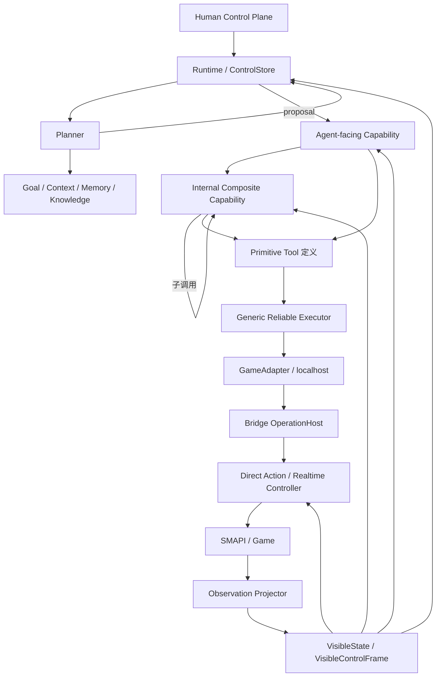
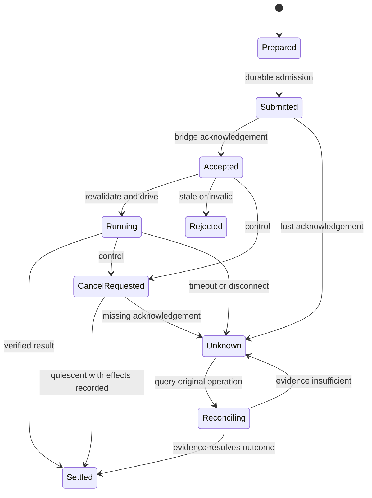
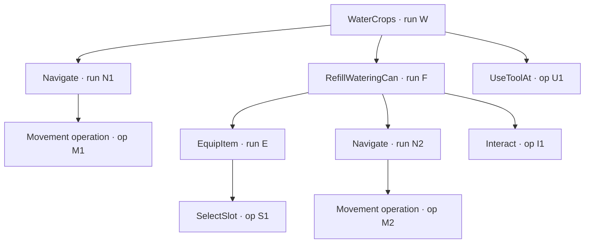
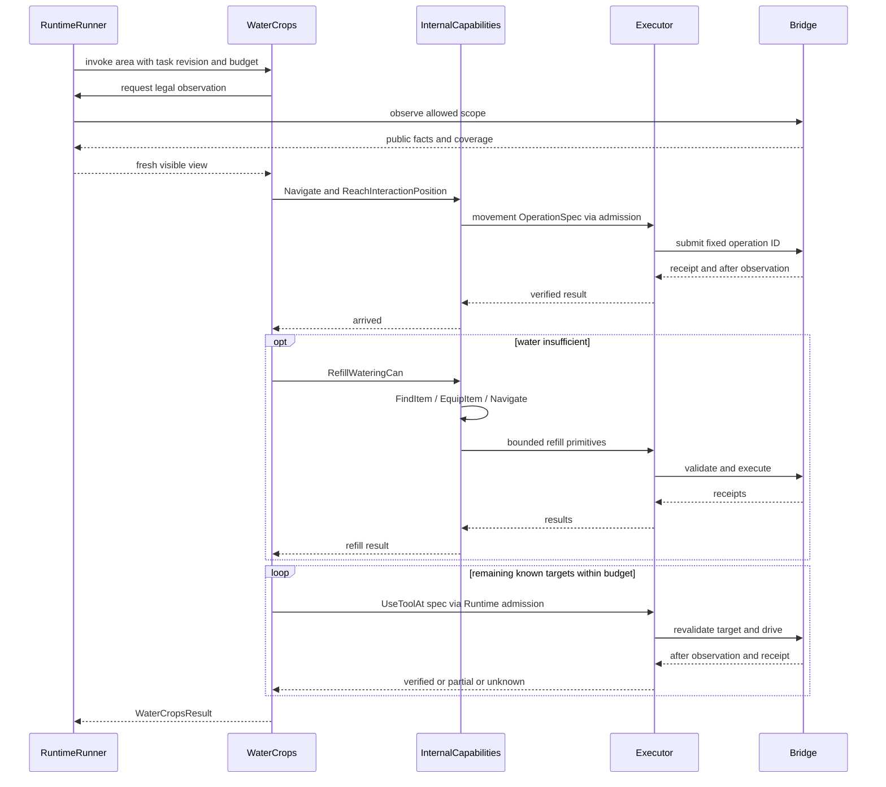
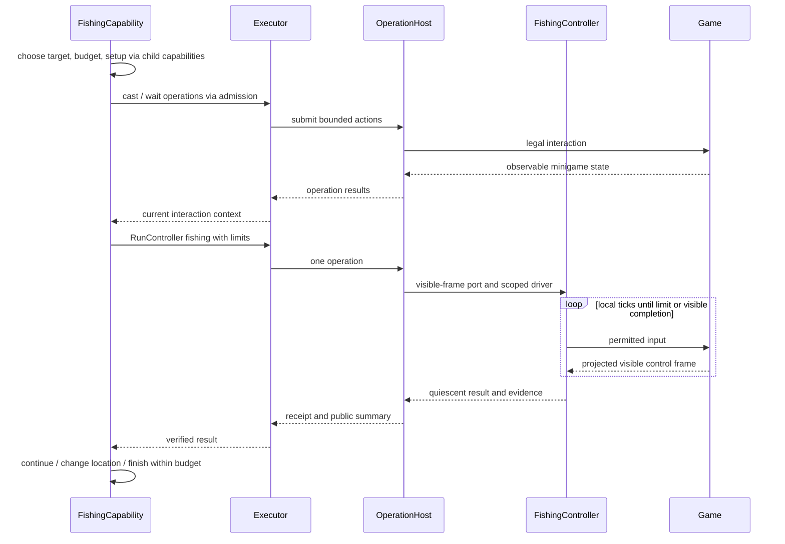
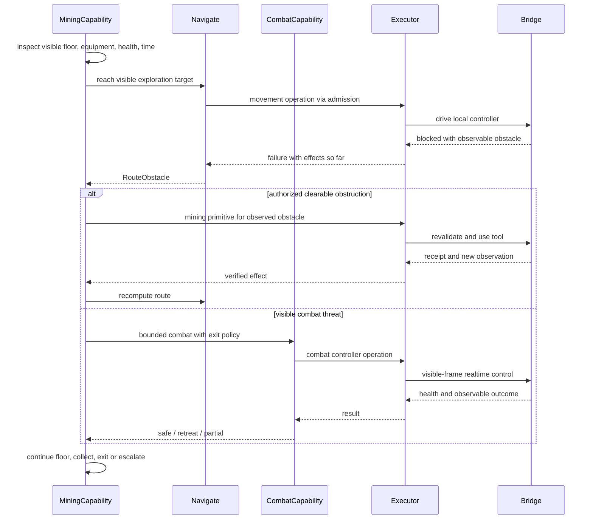
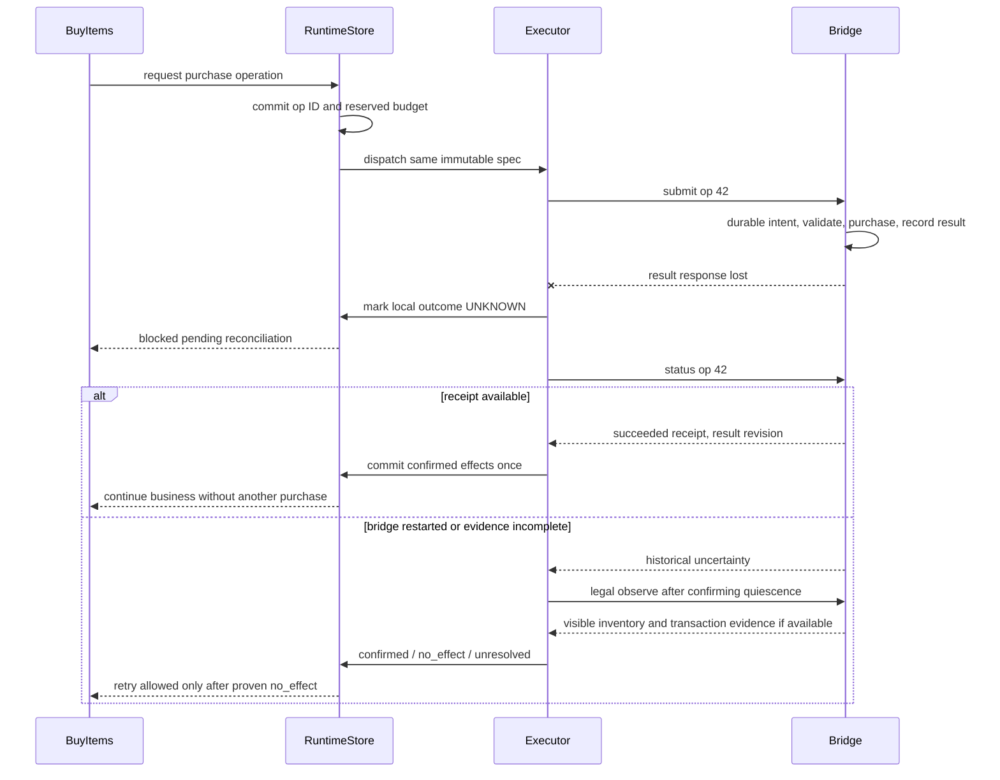
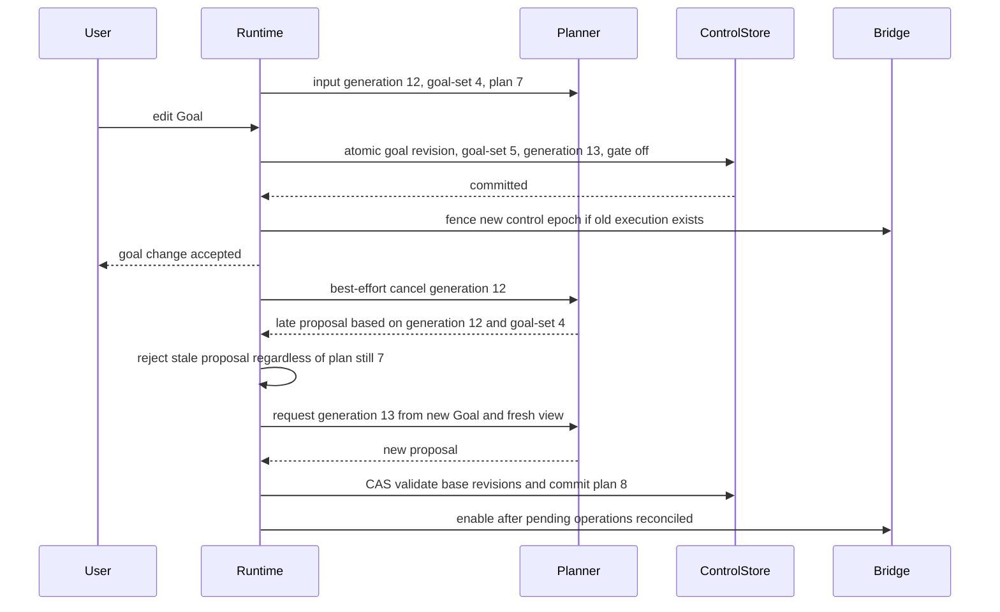

# Stardew Valley Agent — Architecture Specification v1.1

版本：1.1 · 日期：2026-09-25 · 类型：对 v1 的定向返修与完整替代规格

状态：编码前架构基线；尚未进行真实游戏集成验证。本文中的接口和类型是规格，不是已实现代码。

## Change Log

本次以《Architecture Specification v1》为基线，新的用户决策优先于 v1、checkpoint 和原始讨论。保留 Agent Core + Stardew 领域能力 + Harness/SMAPI Bridge 的总体分区，调整能力组合与产品范围，不另造一套架构。本文可独立用于实现，无须从 v1 拼接缺失章节。

| 变更 | v1.1 决策 | 原因 / 影响 |
|---|---|---|
| 保留 Runtime correctness | Runtime 仍是控制状态唯一协调提交入口；Planner 只产生 proposal | 防止模型、UI、异步回执同时改控制状态 |
| 保留信息权限 | AgentVisibleState 与 PrivilegedGameState 隔离；Controller、Risk、Nav 也不得用隐藏真值决策 | 单操作者不等于全知 Agent |
| 保留执行语义 | operation identity、幂等、commit、receipt、timeout、cancel、UNKNOWN、reconcile、前后置校验全部保留 | 两个本地进程也会断连、崩溃和丢回执 |
| 保留状态一致性 | Goal/Plan/Task revision、world/control epoch、证据 freshness、晚到结果校验 | 游戏时钟、剧情、NPC、随机事件仍会改变世界 |
| 保留 Memory/Knowledge 边界 | 目标/承诺归控制状态；经历归 Memory；通用规则归 Knowledge | 更换记忆算法不能丢任务、授权和未决副作用 |
| 保留可观测性 | correctness ledger 常开；可选详细 Trace、层级调用树、before/expected/after/diff、分级 replay | 减少文件数量不能减少恢复依据 |
| 修改产品范围 | v1 仅一个 AI-controlled player，人类仅通过外部控制面介入 | 明确实施边界，取消当前不需要的多人系统 |
| 保留 actor-aware contract | actor_id 在 observation、command、operation、result、control、trace 中存在；当前绑定 agent_player | 为未来多 actor 留基础协议，不实现协调基础设施 |
| 修改能力分层 | Skill 的业务职责迁入统一 Capability；agent-facing / internal / primitive 三种 exposure，允许递归组合 | LLM 调用实际游戏任务，内部链可以复用、测试与追踪 |
| 收缩 Executor | 只处理通用 Operation 生命周期；不持有 WaterCrops/Mining/Fishing 的业务状态机 | business orchestration 与 reliable execution 分开 |
| 保留 C# 实时控制 | Movement/Fishing/Combat/Menu Controller 在 Bridge 本地运行 | 不经 Python HTTP 逐帧往返，不调 LLM |
| 合并实现 | Outbox→ControlStore operation 表；Reconciliation→Executor 方法；EvidenceLedger→观测证据记录；SessionAuth/Fence→Server/OperationHost 内部逻辑 | 语义保留，不提前拆成独立 subsystem |
| 合并 Bridge 执行组件 | Queue、command status/去重与小型恢复记录归 OperationHost；前后置检查归已注册动作 handler | 不引入分布式日志、事务协调器或独立服务 |
| 简化通信 | 一个 localhost 公共 API，短请求/异步 operation/status/event polling；Control 优先处理 | 多种消息语义不需要多套在线通信设施 |
| 修改诊断路径 | privileged 诊断导出到隔离文件，离线工具读取；不要求常驻 privileged server | 保留权限边界，删除不必要在线端口 |
| 收敛跨语言契约 | 仅 Python↔C# 的消息、观测、控制、命令、结果/回执做 schema/codegen | Goal、DayPlan、Task、Memory 等 Python 内部模型可独立迭代 |
| 删除多人实现 | Coordination、Claims、resource leases、shared ownership、MultiplayerAuthority、玩家间避让/死锁/资源仲裁 | 从 v1 implementation tree、流程与验收中删除，不留下空服务 |
| 延后可选重型功能 | 多 Agent、小模型路由器的独立子系统、视觉执行、常驻诊断服务、自动全局加速等按扩展点接入 | 保留合理端口，不为未来创建当前无用的模块 |
| 修正模型调用中改 Goal 的竞态 | proposal 绑定 planning_generation + goal-set revision + plan revision；旧结果只能拒绝/重算 | 只检查 plan revision 不足以发现 Goal 已改但 Plan 尚未提交 |

**范围声明（README 与架构必须一致）：**

> v1 intentionally supports one AI-controlled player. Core action and observation contracts remain actor-aware so future multi-actor support does not require redesigning the foundational protocol.

这表示“协议保留身份”，不表示已有 multiplayer、多 Agent 或人机同时操纵角色的能力。未来引入多人仍需要新的调度、同步与协调设计，只是不必推倒基本消息和 Operation 协议。

## 1. Design principles 与产品范围

### 1.1 本版实现目标

项目仍是具有长期目标、局部执行能力、记忆、知识检索、容错和可调试性的自主星露谷 Agent。长期可以朝完美进度推进，v1 不承诺所有游戏内容都已有实现。能力实现可 Stub，但只有 implemented + adapter-supported 的能力才允许进入可执行列表。

运行拓扑固定为 **Python Agent process ↔ localhost ↔ C# SMAPI Bridge / 单机游戏**。世界中唯一受本系统控制的游戏操作者是 `actor_id="agent_player"`。NPC、怪物、作物和游戏机制仍存在，但不是本系统需要协调的其他 Agent。

人类能够观察、查看状态/计划、pause、resume、修改 Goal/DayPlan、approve/reject。人类 `user_id` 是控制面发起者身份，不是另一个 game actor。游戏窗口的键鼠接管不属于 v1 工作模式；如发生直接人工输入，系统停止新 AI 输入并标为 `UNSUPPORTED_MANUAL_CONTROL`，不进入共同游玩或自动仲裁模式。退出 Agent 后人工游玩是产品外操作；重新连接需 observe/reconcile。

### 1.2 必须保持的十五条 invariant

| ID | 不变量 | 实施位置 |
|---|---|---|
| I01 | AgentVisibleState 与 PrivilegedGameState 严格隔离 | Bridge Projector、端口与数据目录 |
| I02 | Privileged evaluation/diagnostics 不回流在线决策 | diagnostic export、Context/Memory 输入限制 |
| I03 | Runtime 是控制状态的唯一协调提交入口 | Runtime + ControlStore |
| I04 | Planner 产生 proposal，不任意修改共享状态 | proposal 校验与 commit |
| I05 | Goal/Plan/Task/Operation 有明确 identity/revision | 内部模型、wire 执行标签与账本 |
| I06 | Pause/Cancel 不等于 rollback | cancellation 状态机 |
| I07 | 已生效副作用不能假装撤销 | receipt、committed/effect status |
| I08 | Resume 必须重新 observe/reconcile | Runtime resume gate |
| I09 | Capability/Tool 执行前验证相关状态 | Capability 业务判断、Bridge 就地校验 |
| I10 | 副作用 Operation 不因 timeout 盲目重试 | Executor dispatch/reconcile |
| I11 | UNKNOWN 是合法结果 | OperationView、CapabilityResult |
| I12 | Memory 与 Knowledge 严格分离 | 数据 owner、namespace、查询端口 |
| I13 | realtime loop 禁止调用 LLM | C# Controller 依赖限制 |
| I14 | Trace 可关联 before→expected_effect→operation→after→diff | span、operation、evidence IDs |
| I15 | 关闭 debug trace 仍保留 correctness ledger | ControlStore + Bridge 最小恢复记录 |

### 1.3 其他原则

- LLM 面向语义完整的任务能力，不能把移动、选槽和每格浇水展开到日计划。
- 递归组合并不等于无限递归：有调用深度、预算、取消和等待约束。
- 每个业务/执行状态都有 owner；只读快照不是可共同修改的大 dict。
- 计划是意图，观察是某一时刻的证据；单机也不能跳过 stale check。
- 确定性检查、计数、路径和实时操作用代码；LLM 只用于值得推理的高层/局部决策。
- 工程收敛以职责稳定为标准。以后只需拆文件的内部逻辑，现在可以 inline。
- 普通玩家能准确看到的数量准确保存，不故意加噪声；context 压缩不篡改原始事实。
- 不保证接口永不变；以版本、兼容迁移和 ADR 控制局部变化。跨平台仍以 Windows/macOS 为目标，实际兼容性须测试确认。

## 2. System architecture

### 2.1 分层与调用图



上图表达允许的依赖，不表示每一步都必须经过每层：高层 Capability 可直接发一个 primitive；internal Capability 可递归调用其他 Capability；不需要 controller 的动作直接由 Bridge action handler 执行。Executor 位于所有产生游戏副作用的入口，不位于每次纯查询/子函数调用之间。

**CapabilityRunner 是 Runtime 内的业务调用树驱动组件。** 它负责调用注册能力、路由子结果、维护 continuation、预算和取消上下文；具体下一步由 Capability 的业务逻辑决定。**Executor 是 Harness 中的可靠执行边界。** 它只认识 OperationSpec、状态和结果，不根据 `WaterCrops` 名字编排补水或路径。

### 2.2 各层权限与可调用关系

| 层 | 可调用谁 | 状态 ownership | LLM | Memory / Knowledge | 可见信息 | 真值 |
|---|---|---|---|---|---|---|
| Human Control Plane | Runtime commands、只读状态 API | 自己的界面会话，不写控制状态 | 自然语言解析可选，经 gateway；pause 不经过模型 | 默认通过问答/展示，不直改数据库 | 玩家 UI 展示 | 无；开发诊断另行隔离 |
| Runtime | Planner、Runner、Executor、State、Risk、Store | 控制状态唯一协调提交 | 只调度模型任务，不写推理算法 | 按用途查询，触发记忆提案 | 有 | 无 |
| Planner | Context、Memory、Knowledge、能力说明/估算 | 无权威控制状态 | 允许 | 有 scope 和预算 | 有 | 无 |
| Agent-facing Capability | 子 Capability、primitive、合法 observe、scoped query | 业务 continuation 由 Runner 持有并经 Runtime 提交 | 默认代码；安全点的复杂子规划可允许 | 按 manifest 授权 | 有 | 无 |
| Internal Capability | 子 Capability、primitive、合法 observe、scoped query | 同上，自己的子调用状态 | v1 默认禁止；新增需要 ADR/manifest 显式开启 | 按需、只读 | 有 | 无 |
| Primitive Tool 定义 | 构造 OperationSpec，交 Executor | 不持业务流程状态 | 禁止 | 无 | 输入引用、动作相关证据 | 无 |
| Executor | Adapter submit/status/control/observe，静态验证规则 | Operation 状态转换提案；Runtime 持久化 | 禁止 | 无 | 动作相关状态 | 无 |
| Bridge OperationHost / Driver | Projector、已注册 handler/controller、合法游戏交互 | Bridge 本地 Operation/queue 状态 | 禁止 | 无 | 有 | 仅投影/动作合法性必要访问 |
| Realtime Controller | VisibleControlFrame、受限 ActorDriver | 有界操作内的 tick 状态 | 禁止 | 无；只接冻结的策略参数 | 仅该行为合法可见帧 | 禁止用于策略 |
| Diagnostics / Evaluation | 隔离导出文件、离线 fixtures | 自己的诊断/评测结果 | 离线 judge 可选 | 不写生产 Memory | 可用 | 受限可用，不回流 |

Planner 的“直接调用 WaterCrops”是 **agent-facing tool-call 语义**：模型返回的调用先转换为 proposal/task intent，经 Runtime 验证提交，再开始 CapabilityRun。不能让模型 provider 直接连 Bridge 执行动作。纯知识查询可经受控查询端口立即响应，不伪装成有副作用的任务。

### 2.3 部署与通信收敛

v1 使用一个 loopback 公共 API。默认短 HTTP 请求 + `events(after_cursor, limit)` 有界轮询；Operation submit 立即返回已接收状态，执行不占住 HTTP 连接。未来可换事件流，GameAdapter 语义不变。

| 入口 | 内容 | v1 实现规则 |
|---|---|---|
| handshake | 版本、actor binding、会话、observation policy、支持动作/controller | 一个活动控制会话；第二写会话拒绝，不协商资源 lease |
| observe | 指定 actor 和合法观察 scope | 不能远程开箱/扫描世界；必要交互由 Capability 正常执行 |
| submit / status | OperationRequest、接收状态、最终回执 | 异步执行，同 ID 请求可去重 |
| control | pause/fence、cancel、resume-enable、heartbeat | handler 不等动作队列；优先邮箱在每 tick 最先处理 |
| events | 有界公开事件批次、cursor/overflow 标记 | 不含真值；丢事件后用合法 scope 重同步和 operation status 核对 |

控制、观察和执行是不同消息类别，不是三个独立消息总线。Server 不阻塞在长动作/大图像/磁盘；请求长度和事件批次限额防止 pause 饥饿。Python 的 HTTP 客户端不能因一个慢 read 阻塞所有控制请求；可在同一服务上并发短请求，无需额外控制服务。

SessionAuth 是 Server 内部检查：仅绑定 localhost、启动时生成本地 token、UI 不持 Bridge token、每次请求验证会话/actor/scope。无 OAuth/IAM/PKI 子系统；浏览器控制面只连 Python API，验证来源和请求 token。注册插件是受信任本地代码，本版不宣称能沙箱化任意恶意 Python/C# 插件。

privileged 诊断不走公共 API。Bridge 可选写到独立受限目录，由独立离线开发工具读取；生产 ModelGateway/Memory/Retrieval 无读取入口。Future diagnostic server 仅作为延后方案，不出现在 v1 实现树。

## 3. Repository tree

这是替代 v1 的目标实现树，未创建产品源码。`__init__.py`、锁文件和生成的详细类名省略。未实现游戏能力在 catalog 中声明 unavailable，不为每个未来功能创建空 subsystem。

```text
stardew-agent/
  README.md
  pyproject.toml
  .gitignore
  .github/workflows/ci.yml
  docs/
    architecture-v1.1.md
    adr.md
    capability-matrix.md
    bridge-compatibility.md
  configs/
    player.yaml
    developer.yaml
    observation.yaml
    risk.yaml
  protocol/
    wire.schema.json
    actions.schema.json
    fixtures/
      observation.json
      operation_unknown.json
      cancel_receipt.json
  src/sdv_agent/
    app.py
    core/
      models.py
      runtime.py
      store.py
      planner.py
      context.py
      model_gateway.py
      state.py
      safety.py
      human_control.py
    capabilities/
      models.py
      registry.py
      runner.py
    games/stardew/
      domain.py
      farming.py
      fishing.py
      mining.py
      navigation.py
      inventory.py
      crafting.py
      social.py
      progression.py
      primitives.py
      catalog.yaml
    memory/
      models.py
      service.py
    knowledge/
      models.py
      service.py
      retrieval.py
      ingest.py
    harness/
      wire_generated.py
      adapter.py
      smapi.py
      executor.py
      trace.py
      checkpoint.py
      replay.py
  bridge/StardewAgentBridge/
    StardewAgentBridge.csproj
    manifest.json
    ModEntry.cs
    WireGenerated.cs
    PublicServer.cs
    ObservationProjector.cs
    OperationHost.cs
    ActionHandlers.cs
    ActorDriver.cs
    Lifecycle.cs
    Controllers/
      MovementController.cs
      FishingController.cs
      CombatController.cs
      MenuController.cs
    DiagnosticExport.cs
  evaluation/
    runner.py
    metrics.py
    cases/
      watering.yaml
      fishing.yaml
      mining.yaml
      pause_resume.yaml
      lost_receipt.yaml
      goal_edit_race.yaml
      hidden_state_pairs.yaml
  tests/
    fixtures/
      fake_adapter.py
    protocol/
    capabilities/
    runtime/
    privacy/
    bridge_integration/
  scripts/
    generate_wire.py
    build_knowledge.py
    analyze_trace.py
    package_release.py
  resources/
    knowledge-manifest.yaml
    i18n/zh-CN.json
    i18n/en.json
```

没有 `coordination/`、`claims.py`、`MultiplayerAuthority.cs`、lease manager、OutboxService、ReconciliationService、EvidenceLedgerService 或 PrivilegedServer。文件合并不允许取消其必要职责。`executor.py` 即使以后变大，也可只拆内部文件而不改公共接口。

v1 主数据可放单个本地 `agent.sqlite`，按 control/observation/memory/knowledge 表分 owner；ControlStore 的写入仍统一经 Runtime。真值数据不能混进该在线可读库。Bridge 在自己的目录保留小型 operation 恢复记录；它不是第二个全局控制库。详细公开 trace 与私有诊断另存，索引可重建。密钥、存档和用户数据不进 git。

## 4. Module responsibilities 与依赖

| 文件 / 模块 | responsibility | explicitly not responsible for | dependencies | exposed interfaces |
|---|---|---|---|---|
| app.py | 配置、注入、启动/退出、平台路径 | 玩法、跨模块 service locator | 具体实现只在此装配 | `build_app(config)` |
| core/models.py | Goal/Plan/Task/Proposal/Approval/Budget 内部模型 | wire codegen、世界事实来源 | Python 基础模型类型 | 内部 dataclass/验证模型 |
| core/runtime.py | 单写提交、ready task 调度、控制优先级、pause/resume、版本校验 | 逐格动作、浇水补水分支 | Store、Planner、Runner、Executor ports | `handle(event)`、`submit(command)` |
| core/store.py | 控制事务、operation intent/status、审批、continuation、最小 journal | 游戏事务、消息 broker、真值存储 | 本地数据库 | `commit(expected_version, change)`、`pending_operations()` |
| core/planner.py | 目标权衡、日计划、高层能力选择、重规划 | 自己写 Runtime state、原子动作展开 | Context、Registry 的说明/estimate | `propose(PlanningInput)` |
| core/context.py | scoped 数据组装、token 预算、来源/freshness manifest | 调真值、吞全部轨迹 | State、Memory、Knowledge | `build(request)` |
| core/model_gateway.py | 模型调用、输出校验、超时/取消、usage；简单模型选择函数 | 游戏循环、动作权限 | provider、Trace | `infer(role, context, output_model)` |
| core/state.py | 可见观测投影、freshness、库存聚合/搬运去重、证据查询 | Ground Truth、控制状态 owner | 公共 observation/receipt | `apply(event)`、`snapshot()`、`aggregate_inventory()` |
| core/safety.py | 可见 Risk、预算规则、停滞/振荡检查 | 真值裁判、业务重规划、多人仲裁 | State、Goal/偏好快照 | `assess(intent)`、`detect_stall()` |
| core/human_control.py | 外部 UI commands、审批交互、状态/计划展示、本地化简述 | 另一个游戏 Actor、直连 Bridge | Runtime command port | `pause/resume/edit_goal/edit_plan/decide` |
| capabilities/models.py | Manifest/Invocation/Continuation/Result/Context/Step | C# DTO、具体玩法 | core 内部模型、公开 observation types | Capability protocol |
| capabilities/registry.py | exposure、implementation、availability、依赖校验、agent catalog | 动态任意代码执行、权限提升 | manifests | `resolve()`、`agent_catalog()` |
| capabilities/runner.py | 调用树、child result、step 调度、预算继承、cancel token 传播 | 选择种植路线、RPC 重试、直接提交控制数据库 | Capability、Runtime callback、Executor port | `start/advance/suspend/reconcile` |
| games/stardew/domain.py | 领域 ID、日历、长期目标规则、能力装配 | 通用调度器 | 可见事实、Knowledge | `StardewDomain` |
| games/stardew/farming.py | Water/Harvest/Plant 的业务链与进度 | 通用 operation 生命周期 | 内部 Capability、primitives | agent-facing capabilities |
| games/stardew/fishing.py | GoFishing 目标、预算、钓点/循环/退出 | minigame 逐 tick 控制 | Navigate、Equip、controller primitive | `GoFishing` |
| games/stardew/mining.py | GoMining、层内 Explore/Combat 等局部业务编排 | 控制时序可靠性、隐藏矿石查询 | Nav、可见 combat、primitives | `GoMining`、internal combat |
| games/stardew/navigation.py | Navigate、ReachInteractionPosition、已知路线/交通/局部重算 | 选择一天去哪、暗中消耗稀有道具 | 可见地图、交通知识、运动 primitive | internal capabilities、`estimate_routes()` |
| games/stardew/inventory.py | FindItem、EquipItem、OpenContainer、TransferItems、OrganizeStorage | 真值全库存扫描、分布式资源锁 | State 聚合、Nav、primitives | internal + OrganizeStorage |
| games/stardew/crafting.py | BuyItems、CraftItems、配方与材料组合 | 无预算大采购、Executor 内部状态 | Inventory、Knowledge、菜单动作 | agent-facing capabilities |
| games/stardew/social.py | GiftNpc、生日/喜好/合法位置推断 | 全图实时 NPC 真值、隐藏好感读取 | Memory/Knowledge、Nav、Inventory | `GiftNpc` |
| games/stardew/progression.py | 看电视、睡眠/结算、任务/献祭/路线交互；其他场景用 catalog 扩展 | 通用关闭所有菜单 | UI session、注册动作、Risk | 已实现 agent/internal capabilities |
| games/stardew/primitives.py | 有类型 primitive builder、固定 handler ID、动作 predicate/verify 描述 | 业务长链、自由指令执行 | 生成 wire types | `PrimitiveSpec` / builders |
| games/stardew/catalog.yaml | 能力元信息、区域/交互映射、Stub 清单 | 把 unavailable 宣称可用 | versioned IDs | catalog data |
| memory/models.py, service.py | episode/summary/preference/painpoint、检索/保留/摘要方法 | GoalStore、通用规则库、后台真值 | 公开证据、retrieval、gateway 可选 | `append/retrieve/consolidate/supersede` |
| knowledge/models.py, service.py | 版本化规则/策略、精确查询、来源冲突 | 本局箱子/天气真值 | corpus、retrieval | `lookup/search` |
| knowledge/retrieval.py | namespace/版本过滤、lexical/vector/rerank 接口与实现 | 权限提升、选择业务任务 | 授权 corpus/index | `search(query)` |
| knowledge/ingest.py | 导入、别名/结构化提取、来源与版本发布 | 在线改游戏、后台扫描存档 | 资料与 corpus | offline ingestion |
| harness/adapter.py, smapi.py | actor-aware port、握手、传输、DTO 转换 | 玩法、重做未知副作用 | wire + localhost | `GameAdapter` |
| harness/executor.py | 通用 lifecycle、timeout、idempotency、cancel、postcheck、reconcile | WaterCrops/Mining/Fishing 下一步选择 | Adapter、Runtime admission/commit callback | `prepare/dispatch/status/cancel/reconcile` |
| harness/trace.py | 层级 span、状态差分、模型/检索成本 | correctness 状态 owner、真值回流 | public event sinks | `start_span/emit/end_span` |
| harness/checkpoint.py | Runtime snapshot、版本 bundle、安全游戏存档关联 | 任意帧保存承诺 | Store、公开证据版本 | `capture/restore_plan` |
| harness/replay.py | 录制适配器、差异回放、分歧检测 | 反事实游戏模拟器 | 录制公开数据、Adapter port | `RecordedAdapter`、replay CLI |
| Bridge PublicServer.cs | localhost、token/session、协议/actor 校验、优先控制入口 | 执行业务、读全状态接口 | OperationHost、Projector | wire API |
| Bridge ObservationProjector.cs | 私有采样、policy 投影、证据 ID、控制帧 | 策略、人格 | 游戏对象 | `Observe/ControlFrame` |
| Bridge OperationHost.cs | 有界队列、epoch fence、状态/去重、恢复记录、controller 调度、watchdog | 高层能力链、分布式协调 | handlers、driver、server | operation lifecycle + control ack |
| Bridge ActionHandlers.cs | 已注册动作前置/后置规则、可见错误、commit point | 自由反射/API 调用 | Projector、Driver | handler registry |
| Bridge ActorDriver.cs | 给绑定 actor 注入合法输入/交互 | 刷物品、免费传送、业务规划 | 游戏 API | bounded action methods |
| Bridge Controllers/* | 当前合法可见帧的局部高频控制、stop/safe-point | LLM、Memory 查询、秘密 RNG/地图策略 | frame、scoped driver | `tick/stop/result` |
| Bridge Lifecycle.cs, ModEntry.cs | 真实游戏生命周期归一化、版本能力探测、装配 | 多人 authority | SMAPI/game hooks | public lifecycle events |
| Bridge DiagnosticExport.cs | 可选受限真值文件/异常快照导出 | 在线端口、在线风险提示 | 私有采样、开发配置 | offline export |
| evaluation/*, tests/* | 单操作者能力/竞态/权限验收，离线指标 | 多人验收宣称、生产记忆写入 | fixtures、recordings、隔离游戏 | suite runner |
| protocol/*, scripts/generate_wire.py | 跨语言唯一 schema 源、生成、fixture 验证 | 生成 Python Core 的所有模型 | codegen toolchain | generated DTOs |

依赖约束：Core 依赖端口而非 SMAPI 实现；Capability 只通过 CapabilityContext 访问 scoped query/调用接口；primitive builder 不调用网络；Executor 不 import Stardew 的 Capability 类；Controller 不依赖 Planner/Memory/LLM。Bootstrap 是具体实现汇合处。Trace 作为 sink 无反向决策依赖。

## 5. Capability hierarchy

### 5.1 统一名词，区分 exposure 与 implementation

Capability 是“具有输入、结果、权限、预算和生命周期的可调用能力”。其 manifest 的 **exposure** 与 **implementation kind** 是两个字段，不能用“代码短不短/有没有 LLM”代替边界。

| exposure | 调用者 | 例子 | 实现 |
|---|---|---|---|
| agent | Planner/LLM，经 Runtime admission；其他授权 Capability | WaterCrops、HarvestCrops、PlantCrops、GoFishing、GoMining、GiftNpc、OrganizeStorage、BuyItems、CraftItems | 业务过程，可组合多个子能力 |
| internal | manifest 允许的父 Capability；默认不在 LLM 工具列表 | Navigate、FindItem、RefillWateringCan、EquipItem、ReachInteractionPosition、OpenContainer、TransferItems | 纯函数、短过程或复合过程 |
| primitive | 经 Runner 的授权 Capability 调用；只形成单个 OperationSpec | MoveDirection、UseToolAt、Interact、SelectSlot、SelectMenuOption、PressButton、UseMinecart | 直接动作或有界 controller invocation |

`implementation_kind = procedure | primitive_operation`。v1 不把“Composite”再做一个服务；procedure 可以逐步发起子调用。Skill/Subplanner 保留为业务习惯用语，映射到 Capability 内实现，不再与 Capability 平行注册一套 Skill 系统。

三个重要细节：

1. `UseMinecart` 若是 primitive，只能表示**已到站并处于合法交互上下文时的一次目的地选择/乘坐动作**；走到站点、开菜单、选择与换图确认由 Navigate 组合。若某版本需要多步，则该名字实现为 internal procedure，最小叶子仍是 Interact/SelectMenuOption。
2. `PressButton` 不能是 LLM 通用作弊后门。只允许 action manifest 指定的按键、持续 tick 上限与 UI/world scope；禁止控制台命令、任意脚本和无期限按住。
3. `RunController(kind, context, limits)` 是内部 primitive operation 模式，不是 agent-facing tool。它可驱动一个有界移动段、一次钓鱼 minigame 或一段战斗控制，不能接收“完成今天所有挖矿”的开放业务目标。

### 5.2 递归调用协议

每次 procedure 调用产生 `capability_run_id`，带 `parent_run_id/root_run_id`。父能力只收到结构化子结果；不展开或复制子实现。递归组合通过 Runner，而不是各文件互相直接调用产生不可追踪的函数栈。

```typescript
interface Capability {
  describe(): CapabilityManifest;
  estimate(args, context): CostEstimate;
  begin(invocation, context): Step;
  advance(continuation, child_or_world_event, context): Step;
  reconcile(continuation, fresh_visible, resolved_operations): ResumeDecision;
}
type Step =
  | {kind:"invoke"; capability_id:string; args:object; child_budget:Budget}
  | {kind:"primitive"; spec:OperationSpec}
  | {kind:"observe"; scope:ObservationScope}
  | {kind:"query"; query:MemoryQuery|KnowledgeQuery}
  | {kind:"wait"; condition:WaitCondition; deadline:Deadline}
  | {kind:"need_decision"; request:DecisionRequest}
  | {kind:"complete"; result:CapabilityResult};
```

这是接口草案，不要求自造一门 workflow DSL。实现可以用显式状态机；重要的是每个 await/safe point 有可保存 continuation，不能把 Python generator 的内存栈当作唯一恢复依据。

Runner 检查 child allowlist、exposure、actor/scope、预算不扩张、最大深度/调用数、cancel 状态。v1 业务子调用顺序执行；独立纯知识查询可以并行，不创建多条游戏写流。禁止调用环无限递归；合法循环通过同一过程的状态转移，并消耗累计预算。新 Capability 必须声明 `implemented` 和依赖，Stub 不可调用。

父结果聚合规则必须固定：所有子 operation 都已静止且必要目标有证据，才可标业务完整完成；任一子调用仍有未决效果，父结果必须携带其 unresolved_operation_ids，不能用一句“子任务失败已跳过”丢掉它。若目标目前已满足但动作归因仍 UNKNOWN，可设 `goal_satisfied=true`，同时保留 `status=unknown/partial` 与未决账务，Runtime 不再重复实现同一效果。取消后的已确认部分进度照常上报，失败/取消状态不把 counts 清零。

### 5.3 Business orchestration 与 Reliable execution

| 问题 | owner |
|---|---|
| 这块地是否值得继续浇、先去哪片、是否补水 | WaterCrops / 内部 Capability |
| 补水前需要找水壶/导航/到交互位置 | RefillWateringCan 的子调用链 |
| 钓点收益差要不要换点、何时结束 GoFishing | FishingCapability |
| 矿层里先处理近怪还是挖挡路石 | Mining/Combat 内部业务策略 |
| 请求是否已发、相同 ID 是否重复、旧 epoch 是否失效 | Executor + Bridge OperationHost |
| 超时后是否存在已生效副作用 | Executor.reconcile + Bridge 回执/合法观测 |
| 一次动作前后状态是否满足已注册规则 | Bridge handler，Executor 聚合公开验证结果 |
| 一项任务是否完成，是否启动下一项 | Runtime 根据 CapabilityResult 和任务成功条件提交 |

Executor 接收注册动作的 validation/verification contract，不拥有浇水算法。比如 handler 知道 UseToolAt 的合法范围；WaterCrops 知道本次任务想让哪些作物得到水。通用 Executor 只负责在正确时间运行对应检查并解释结果状态。

### 5.4 WaterCrops 的完整业务边界

输入：`WaterCrops(area="north_field", policy=?, budget=由Runtime注入)`。模型不能自行给自己签发预算。

1. 获取当前合法可见状态、时钟及 area 的已知覆盖范围。
2. 判断意图仍有效：目标 revision、区域引用、剩余 deadline；已经满足则返回成功 no-op，有证据说明。
3. 查询业务条件：实际可见天气、作物与地块情况、水壶/水量、体力、时间；不知道区域现况时要正常到场观察，不能凭 ID 远程扫描。
4. 选出应浇目标并记录观察依据；未知目标不当作无需浇水。
5. 组织有界目标批次和局部路线，不把所有 primitive 放进日计划。
6. 调用 Navigate / ReachInteractionPosition，到达后复查目标。
7. 水不足调用 RefillWateringCan；它可继续调用 FindItem/EquipItem/Navigate/Interact。
8. 发出 UseToolAt 等 primitive spec，经可靠 Executor 执行。
9. 用 after evidence 验证实际浇水效果，按 effect ID/目标去重更新进度。
10. 局部路径阻塞、菜单变化等在预算内恢复；partial/cancel/stale/UNKNOWN 通过正式结果与 continuation 处理。
11. 返回高层结果；超预算、需要改大目标或无法解决未知副作用时升级 Runtime。

```typescript
type WaterCropsResult = CapabilityResult & {
  watered_count: int; skipped_count: int;
  skip_reasons: {reason:string; count:int; evidence_refs:string[]}[];
  remaining_known_count: int;
  coverage_complete: boolean; unknown_areas: string[];
  stamina_used: MeasuredAmount; game_minutes_used: MeasuredAmount;
  failure_or_partial_reasons: FailureSummary[];
};
```

`watered_count` 只计已确认由该调用树造成的浇水，不能把雨水或先前已浇目标算自己的成绩。skipped 区分 already_satisfied、not_applicable、deferred；未知区域不纳入“都完成了”。effect 未核实时保留 unknown costs，不能填 0。恢复后以同一任务的已确认效果去重，避免在累计与当前尝试之间重复计数。

Planner 正常只看到 `WaterCropsResult` 的摘要、必要失败与未决项；Trace 可见整个父子调用树和叶子操作。LLM prompt 不自动加入数百条移动记录。

### 5.5 其他能力的边界核验

| 能力 | 高层意图 | 内部复用 | 叶子执行 / controller |
|---|---|---|---|
| HarvestCrops | 收获区域作物 | 调查、Navigate、容量处理 | Interact/UseToolAt |
| PlantCrops | 在给定范围种指定作物 | 找种子、整地、播种、按授权选择浇水 | SelectSlot、UseToolAt、Interact |
| GoFishing | 给定地点/目标/时段垂钓 | Find/Equip、Nav、抛竿循环、退出判断 | Cast 对应 primitive、FishingController、MenuController |
| GoMining | 资源/进度与风险预算 | Enter/ExploreFloor、Navigate、Combat、采矿、拾取、撤离 | Movement/Combat controller、UseToolAt、Interact |
| GiftNpc | 给指定 NPC 合适礼物 | 查生日/喜好、Find/Equip、寻找/导航 | Interact、确认赠送动作 |
| OrganizeStorage | 整理已授权容器 | OpenContainer、分类、TransferItems | 菜单/槽位 transfer 对应动作 |
| BuyItems / CraftItems | 购买/制作目标数量 | 查机制、核库存、找材料、导航、菜单 | SelectMenuOption/注册购买制作动作 |
| Navigate | 到达目标，遵守交通额度 | 已知路线、矿车连接、局部重算 | MoveDirection/MovementController、UseMinecart |
| 社区中心规划 | 长期缺口与路线权衡在 Planner | Progression 内部检查/提交能力 | 献祭菜单中的合法选项 |

允许的顺路拾取、清障、消耗传送物品必须在父预算和 manifest 中声明。导航遇树不能擅自砍掉，内部能力也不能以“完成目的地”为理由越过风险授权。

## 6. Core data contracts

本章是接口草案，使用语言中立记法：`?` 可缺省、`UUID` 唯一 ID、`MeasuredAmount` 区分 measured/estimated/unknown。具体序列化与 Python 内部类型分别定义，不要求全文类型都生成 JSON Schema。

### 6.1 Wire contract 与 Internal domain model

| 类型 | wire? | Source of Truth | 原因 |
|---|---|---|---|
| ProtocolEnvelope、WorldScope、GameClock、EntityRef、EvidenceRef | 是 | `protocol/wire.schema.json` | 共同识别作用域、时间和证据 |
| GameObservation、公开 Event、ObservationRequest | 是 | wire.schema.json | C# 产生、Python 消费 |
| OperationRequest、Status/Result、Receipt、PublicError | 是 | wire.schema.json | 副作用执行/核对跨进程 |
| ControlRequest/Ack、Handshake、ActionManifest 摘要 | 是 | wire.schema.json | pause/cancel/epoch/session/能力协商 |
| 已注册 primitive/controller args/result、白名单 Predicate | 是 | `protocol/actions.schema.json` 引用 wire 类型 | 两端对具体执行参数/验证语义一致 |
| ExecutionRefs 中的 plan/task ID 和 revision | 是，只有引用 | wire.schema.json | 关联与审计；不传整个 Goal/Plan |
| Goal、DayPlan、Task、PlanProposal、ApprovalRequest | 否 | `core/models.py` | Python 控制域，不因内部变化重生成 C# |
| CapabilityManifest、Invocation、Continuation、CapabilityResult | 否 | `capabilities/models.py` | procedure 编排仅在 Python；叶子降为 wire Operation |
| MemoryEntry、KnowledgeQuery、RetrievalResult | 否 | 对应 Python models.py | 内部认知与检索 |
| AgentVisibleState、ContextBundle | 否 | State/Context 的内部模型 | 由 wire observation 构造 |
| PrivilegedGameState、VisibleControlFrame | 否，C# 内部类型 | ObservationProjector/Controller 接口 | 真值不跨公共协议；tick 帧不逐帧发 Python |
| ExecutionTrace / ContextManifest | 否，独立版本化记录格式 | harness/trace.py | 内部/离线消费者；Bridge 发小型 wire 事件供归并 |

所有 `.schema.json` 仅描述真实跨语言边界；从它们生成 Python/C# DTO，生成文件不手改。Core 的序列化、DB migration、模型结构化输出验证使用本地类型。LLM 工具参数 schema 可由 agent-facing manifest 的 Python 参数模型临时生成，不意味着它是 Bridge wire 协议。

v1 尚无已发布运行实现，所以 v1→v1.1 不制造兼容旧 Skill API 的适配层。以后已有存档/执行记录时再要求迁移器。

### 6.2 Wire 基础与观测

```typescript
type WorldScope = {
  game_id: string; save_id: string; branch_id: string;
  world_epoch: string; actor_id: string;
};
type GameClock = {
  absolute_day?: int; time_of_day?: int; simulation_tick: int;
  phase: "world"|"menu"|"cutscene"|"loading"|"sleep_transition";
};
type WireEnvelope = {
  protocol_version: string; message_id: UUID; session_id: UUID;
  scope: WorldScope; correlation_id: UUID; causation_id?: UUID;
  wall_utc: string; game_clock?: GameClock;
};
type EntityRef = {
  namespace: string; opaque_id: string; generation: int;
  location_instance?: string;
};
type EvidenceRef = {
  observation_id: UUID; fact_id?: UUID; source_actor_id: string;
  acquisition: string; observed_at: GameClock;
};
type ObservedFact = {
  fact_id: UUID; subject: EntityRef; predicate: string; value?: JsonValue;
  epistemic: "observed"|"reported"|"inferred"|"unknown";
  evidence: EvidenceRef[]; valid_for?: {from:GameClock; until?:GameClock};
};
type GameObservation = WireEnvelope & {
  observation_id: UUID; observation_seq: int; policy_version: string;
  channel: "hud"|"local_scene"|"interaction"|"dialogue"|"vision";
  facts: ObservedFact[];
  coverage: {requested:string[]; observed:string[]; unknown:string[]};
  public_artifacts?: {kind:string; ref:string}[];
};
```

Stardew 要求日期/时间字段存在；actor-aware 接口不把它们解释成所有游戏必有的资源。`actor_id=agent_player` 在 app 配置/handshake 绑定，不能把该字符串写死在 schema enum、全局 `get_player()` port 或所有调用内。

world_epoch 在读档、恢复或 Bridge 重新建立世界执行实例时轮换；网络短断重连不自动等同读档。branch_id 防止回档后拿未来 Memory 决策。observation_seq 只对公开 observation 排序，不暴露全世界私有 mutation counter。跨进程不比较各自 monotonic clock 数值；wire 使用 duration budget/剩余时长，接收端建立自己的 monotonic deadline，并可附游戏 deadline。

### 6.3 Wire Operation 与 Result

```typescript
type ExecutionRefs = {
  run_id: UUID; root_capability_run_id: UUID; capability_run_id: UUID;
  plan_id?: UUID; plan_revision?: int;
  task_id: UUID; task_revision: int; attempt_id: UUID;
};
type OperationRequest = WireEnvelope & {
  operation_id: UUID;
  idempotency_key: string; semantic_payload_hash: string;
  control_epoch: int; execution: ExecutionRefs;
  action_id: string; action_version: string; args: ActionArgs;
  targets: EntityRef[]; evidence_refs: EvidenceRef[];
  required_preconditions: Predicate[]; expected_effect: Predicate[];
  limits: {max_duration_ms:int; game_deadline?:GameClock;
           max_input_ticks?:int; effect_budget:EffectBudget};
  authorization: {admission_id:UUID; policy_version:string;
                  approved_effect_scope:object; approval_ref?:UUID};
};
type OperationResult = WireEnvelope & {
  operation_id: UUID; result_revision: int; control_epoch: int;
  execution: ExecutionRefs;
  phase: "accepted"|"running"|"cancel_requested"|"quiescent"|"unknown";
  outcome?: "succeeded"|"partial"|"failed"|"cancelled"|"rejected"|"unknown";
  effect_status: "none"|"some"|"all"|"unknown";
  quiescent: boolean|"unknown";
  receipts: EffectReceipt[]; postcondition: "satisfied"|"unsatisfied"|"unknown";
  observation_refs: UUID[]; error?: PublicError;
  actual_costs?: CostRecord; elapsed_ms?:int;
};
type EffectReceipt = {
  effect_id: UUID; operation_id: UUID; actor_id: string;
  kind: string; target?:EntityRef; public_outcome:object;
  evidence_refs: EvidenceRef[];
  attribution: "confirmed_action"|"world_effect"|"uncertain";
};
```

`operation_id` 已足够作为默认 idempotency_key，不要求额外幂等服务。semantic hash 排除重连时变化的 transport message/session 字段，包含 actor、目标、动作参数、效果上限与语义版本；相同 operation ID 不得携带不同语义内容。OperationRequest 不可变；状态变化是递增 result_revision 的追加记录。Python OperationRecord 另有本地 revision，不能与 Bridge result_revision 混为一个全局版本。

Bridge 不需要理解 Goal/DayPlan 的业务模型。Runtime 负责检查 goal/plan/task 是否当前，Bridge 负责 epoch/session/world、action contract 和 effect scope。在同一单机 token 信任边界内，authorization 是受认证 Runtime 发送的受限指令，不引入签名 token/PKI 服务；其 digest、额度与审批引用必须入账，LLM 不具备发送该 wire request 的能力。

postcondition 由注册 handler + 请求中允许的收紧约束构成。模型不能提交“永远 true”替换验证规则。Predicate 是白名单字段/比较/布尔组合，不是 arbitrary eval；unknown 不当 true。

### 6.4 Wire Control 与 Event

```typescript
type ControlRequest = WireEnvelope & {
  control_id: UUID; kind: "pause"|"cancel_operation"|"enable"|"heartbeat";
  new_control_epoch?: int; operation_id?: UUID;
};
type ControlAck = WireEnvelope & {
  control_id: UUID; accepted_control_epoch: int;
  dispatch_enabled: boolean;
  quiescent: boolean|"unknown"; affected_operation_ids: UUID[];
};
type PublicEvent = WireEnvelope & {
  event_id: UUID; event_seq: int;
  kind: "observation"|"operation_progress"|"operation_result"|
        "day_ready"|"day_transition"|"menu_changed"|
        "capabilities_changed"|"stream_gap";
  payload: TypedEventPayload;
};
```

pause 更新 control_epoch 并关闭 Bridge dispatch gate。enable 必须是 Runtime 完成恢复检查后的显式命令；不能因为收到新 epoch 的任意动作就自动恢复。ControlRequest 不传 Goal/Plan。event_seq 只覆盖公开事件，不为私有事件递增并透露“这里漏了一个秘密事件”。

### 6.5 Python 内部控制模型

```typescript
type Goal = {
  goal_id: UUID; revision:int; title:string;
  origin:"user"|"agent_proposal"|"game_quest";
  status:"proposed"|"active"|"blocked"|"achieved"|"abandoned"|"archived";
  priority:int; protected:boolean; success_predicate:DomainPredicate;
  deadline?:GameClock; evidence_refs:EvidenceRef[];
};
type DayPlan = {
  plan_id:UUID; revision:int; actor_id:string; absolute_day:int;
  goal_set_revision:int; task_ids:UUID[]; dependencies:TaskEdge[];
  budget:Budget; assumptions:EvidenceRef[];
  status:"draft"|"active"|"suspended"|"superseded"|"closed";
};
type Task = {
  task_id:UUID; revision:int; actor_id:string; goal_refs:GoalRevisionRef[];
  capability_id:string; args:object; success_predicate:DomainPredicate;
  budget:Budget; deadline?:GameClock; dependencies:UUID[];
  status:"pending"|"ready"|"running"|"waiting"|"suspended"|
         "completed"|"failed"|"cancelled"|"superseded";
  progress:object; effect_refs:UUID[]; unresolved_operation_ids:UUID[];
};
type PlanningInput = {
  planning_generation:int; goal_set_revision:int; goal_refs:GoalRevisionRef[];
  base_plan_revision?:int; control_epoch:int;
  visible_revision:int; visible_snapshot_ref:string;
  capability_catalog_version:string; policy_version:string;
};
type PlanProposal = {
  proposal_id:UUID; based_on:PlanningInput;
  proposed_tasks:TaskIntent[]; dependencies:TaskEdge[];
  estimates:CostEstimate[]; assumptions:EvidenceRef[]; explanation:string;
};
type OperationRecord = {
  operation_id:UUID; revision:int; actor_id:string;
  spec:OperationSpec; dispatch_state:"prepared"|"sending"|"submitted"|"unresolved"|"settled";
  latest_bridge_result_revision?:int; latest_result?:OperationResult;
  local_outcome?:"unknown"; reserved_budget:BudgetSlice;
};
```

Task 没有 `owner=human/shared`、ResourceClaim 或租约。进度追加只增加 store/journal sequence；task revision 只在意图/参数/预算变化时增加，避免每浇一格使全部旧关联失效。GoalSet revision 用于发现目标新增/删除；仅比每个旧 Goal 的 revision 无法检测集合改变。planning_generation 用于使某次正在推理的请求整体失效，不随每一帧观测上涨，避免永远无法提交。

Context 中的可见事实有 `freshness=current_at_observation/stale/invalidated` 和 unknown 标记。提案先检查控制/目标版本是否匹配，再按事实依赖和当前时间重验证，不能因 unrelated observation_seq 增长就全量拒绝。

### 6.6 Capability 内部模型

```typescript
type CapabilityManifest = {
  id:string; version:string;
  exposure:"agent"|"internal"|"primitive";
  implementation_kind:"procedure"|"primitive_operation";
  implemented:boolean; input_model:string; result_model:string;
  required_adapter_actions:string[]; allowed_children:string[];
  observation_scopes:string[]; query_scopes:string[];
  llm_policy:"forbidden"|"safe_point_only";
  effects:string[]; cancellation_policy:string; resume_policy:string;
  continuation_version?:string;
};
type CapabilityInvocation = {
  capability_run_id:UUID; parent_run_id?:UUID; root_run_id:UUID;
  capability_id:string; capability_version:string; actor_id:string;
  task_id:UUID; task_revision:int; control_epoch:int;
  args:object; budget:Budget; cancel_scope_id:UUID;
};
type CapabilityContinuation = {
  capability_run_id:UUID; revision:int; version:string;
  phase:string; business_progress:object;
  active_child_run_id?:UUID; active_operation_id?:UUID;
  completed_effect_ids:UUID[]; unresolved_operation_ids:UUID[];
  assumptions:EvidenceRef[];
};
type CapabilityResult = {
  capability_run_id:UUID; parent_run_id?:UUID; actor_id:string;
  status:"succeeded"|"partial"|"blocked"|"failed"|"cancelled"|"unknown";
  goal_satisfied:boolean|"unknown"; progress:object;
  effect_refs:UUID[]; evidence_refs:EvidenceRef[];
  cost:CostRecord; failures:FailureSummary[];
  unresolved_operation_ids:UUID[];
  next_need?:"observe"|"replan"|"approval"|"user_help";
};
```

CapabilityRun 的暂停是 `suspended` 控制状态，不强制返回 terminal cancelled。显式 cancel 才结束该 run；后续重新尝试生成新 run/attempt，保留 resumed_from 关联与已确认效果去重。成本按 effect ID 只扣一次；父节点聚合子节点成本，不在每层重复扣预算。UNKNOWN operation 的可能消耗保守占用额度，核对后释放或结算。

Budget 包含 game deadline、wall operation limit、金钱/物品支出上限、体力/生命保留、背包空间、局部重试/调用深度/LLM token 限额及获准交通方式。v1 仅实现 Stardew 需要的资源类型，不建设通用资源调度器。

### 6.7 其他内部模型

| 模型 | 关键字段 | 更新/生命周期 |
|---|---|---|
| MemoryEntry | id/revision、save/branch/agent/user scope、kind、content、epistemic、evidence/parent refs、goal/knowledge refs、review_after、status | append/supersede/archive，显式偏好不被推断覆盖 |
| KnowledgeRecord | record ID/revision、game/mod version、source URI/locator、content hash、extraction version、verified/conflict set | 离线发布、在线只读、索引可重建 |
| KnowledgeQuery | fact/strategy/comparison、entity IDs/text、version/mod/source/spoiler filters、结果/token/time 上限 | 一次查询 |
| RetrievalResult | namespace、hits+provenance+scores、filters、conflicts、truncated、index revision、latency | 一次查询/带完整 key 缓存 |
| ApprovalRequest | approval ID/revision、status、user identity、actor、goal/plan/task versions、action digest、effect limits、expiry、timeout behavior | pending→approved/denied/expired/revoked/consumed/superseded |
| InterruptEvent | interrupt ID、user/runtime/game/watchdog source、actor/target run、pause/cancel/goal-edit/menu/deadline reason | immutable command/event、去重 |
| ExecutionTrace | trace/span/parent IDs、actor、capability/operation refs、versions、state-before/expected/after/diff、timestamps、usage、outcome | append-only，独立 trace format version |
| PrivilegedGameState | 私有 snapshot、game/mod build、原始对象/隐藏 flags、capture quality | C# 内部短采样/隔离诊断；禁止进入公共 DTO |
| VisibleControlFrame | actor、frame_seq、game_clock、policy、可见区域/目标/UI、自身公开状态 | C# 本地高频环形缓冲，Controller 只读 |

## 7. State ownership

| 状态 | 谁创建 / 拥有 | 谁能修改 | 谁只读 | 可进 LLM context |
|---|---|---|---|---|
| 游戏世界 | Game | 合法游戏引擎/ActorDriver 操作 | Projector/validators | 仅合法投影 |
| PrivilegedGameState | Projector 内私有读取 | 新建不可变采样 | validator、隔离 diagnostics | 禁止 |
| GameObservation | Projector | 不可变 | State、Executor、公开 trace | scoped facts 可以 |
| AgentVisibleState | State reducer | 归并新 observation/receipt 后出新版本 | Planner/Capabilities/Risk | 可以，保留 unknown/stale |
| Goal/DayPlan/Task | 用户/Planner 提议，Runtime 接受 | 只经 Runtime 协调并提交 Store | 其他 Core 模块 | 当前摘要可以 |
| Capability continuation/call tree | Runner 提议 | Runtime 提交，Runner 随后推进 | 对应业务能力、debugger | 默认仅高层结果 |
| Python OperationRecord | Executor 提议 | Runtime 提交 Store | Executor/Runner/恢复逻辑 | 公开摘要/错误可以 |
| Bridge operation/queue state | OperationHost | 本地 host 状态机 | Server/handler/controller | 只允许公开 result |
| Approval | HumanControl/Risk 提议 | Runtime 记录已验证用户决定与有效性 | Executor 读取 admission scope | 公开理由，不给凭证 |
| MemoryEntry | MemoryService | 追加/版本替代，不改原证据 | scoped query | 过滤后可以 |
| Knowledge | 离线 ingest | 版本发布 | 所有授权查询者 | 带 provenance 可以 |
| Trace | producers → sink | append-only | debugger/evaluation | 原始 trace 不被在线检索 |

Runtime single-writer 的对象是 **控制域**。这不意味着 C# 不能维护本地操作状态，或 MemoryService 必须让每次索引写入经过 Runtime；它们各有 owner，跨边界用事件/结果提交，不能一起改 Goal/Task/OperationRecord。

Executor 发副作用前必须 await Runtime 的 durable admission；结果到达后也提交 Runtime，再由 Runner 消费。没有“Executor 偷改数据库、Runtime 稍后猜发生了什么”的路径。State 事实更新和控制提交按 causal refs 关联，不承诺跨 Python DB 与游戏世界的 ACID。

## 8. Execution lifecycle

### 8.1 最小可靠实现

Operation 是一次明确参数、作用范围有界的游戏副作用请求。它可以是一条 primitive，也可以是一次有界 controller operation；不等于整个 WaterCrops 根调用。

1. **构造**：Capability 发出 primitive Step；builder 得到 OperationSpec，带 expected_effect、证据、目标、limits。无网络、无副作用。
2. **Admission**：Runner/Runtime 检查当前版本、父预算、cancel、exposure 和 Risk；如需审批，先挂起业务调用，不发送 Operation。
3. **Durable prepare**：ControlStore 在同一事务保存 operation_id、请求语义、预算保留、父调用与 `prepared` 状态。这个表内状态承担 outbox 语义，不新增 outbox service/broker。
4. **Dispatch**：Executor 使用固定 operation_id 发送；Bridge 验证 token/session/actor/world/epoch/动作 schema/额度和重复 ID。accepted 只表示接收，不等于 commit。
5. **Just-in-time validation**：OperationHost 在真正执行的游戏 tick 重新检查目标、菜单 session、当前参数/资源、前置条件和 control gate；检查与单步副作用尽量在同一主线程调度段内发生。
6. **Commit / drive**：调用正常游戏交互或本地 controller。多 tick 的 controller 在每个可失效点检查限额/可见条件；commit 可以有多个 effect，不假装整次操作原子。
7. **Observe / verify**：handler 提供 after observation 与注册 postcondition 结果；Executor 聚合结果，不以“请求未报错”代替效果。结果不清楚则 UNKNOWN。
8. **Record / continue**：Runtime 保存 receipt、cost、operation 状态，Runner 给父 Capability 子结果；父业务决定补水/换目标/重试/退出，Runtime 最后决定 Task 完成和下一个任务。

### 8.2 状态机与 UNKNOWN



Settled 的 outcome 可以是 succeeded/partial/failed/cancelled/rejected；UNKNOWN 是对执行或效果没有足够证据的状态，不自动等于失败。`quiescent=true` 与 `effect_status=unknown` 可以并存：已证明停止输入，但尚不能证明先前买了几件。UI 应同时显示这两个维度。

**同一 operation ID + 同一语义：只查询/返回当前记录，不再开始第二次效果。相同 ID + 不同语义：协议错误。** 已确认执行失败且 `effect_status=none` 时，业务 Capability 可以依据恢复策略提出新的 attempt/operation；Executor 不能自己选择新动作。

### 8.3 Bridge CommandLedger 的 inline 实现

OperationHost 内部有有界 operation map 与小型本地恢复记录，无独立 CommandLedger subsystem。至少记录：操作 ID/semantic hash/scope、accepted、准备提交的 marker、结果/receipt、最后公开 revision。写盘由 IO worker 处理，游戏主线程不阻塞等待磁盘。

为了保证恢复记录有含义，执行顺序须明确：

- durable accepted intent 未完成时不能开始动作。
- 写入 `may_execute` marker 并确认落盘后，动作才获得主线程调度资格；**该 marker 不声称效果已发生**。
- IO 确认后重新校验 control_epoch/gate 和前置条件，防止期间收到 pause。
- 效果发生后写完成结果。崩溃落在 marker 和结果之间，按 UNKNOWN 恢复，不伪造“刚才没做”。

这只是本地每 operation 的恢复证据，不做两阶段分布式事务。Python 与 Bridge 都需要保留记录：Python 证明“授权并尝试发送了什么”，Bridge 证明“收到了什么、可能执行到哪”。二者不能互相替代。

同一 Bridge 启动实例内，`NOT_FOUND` 的含义也必须结合原请求是否还可能在传输/队列中判断。跨重启/记录回收后的找不到不是未执行证明。重启后旧 session/epoch 禁止再提交，但允许认证后查询历史 ID；对账与旧请求重新执行是两个不同权限。

有界 operation map 只限制内存，不允许连同 durable 去重依据一起静默驱逐。去重记录至少覆盖 ControlStore 的恢复窗口；未决操作不得回收。大 payload 可归档，保留 ID/hash/最终状态索引。需要结束旧恢复窗口时先轮换 world execution epoch、拒绝旧 epoch submit；历史状态缺失仍报无法证明，不能把旧 ID 当全新命令接受。

不承诺 exactly-once 游戏效果。对于不能精确核对的不可逆动作，宁可挂起为 UNKNOWN，也不能靠新 operation_id 绕开去重强行再做。

### 8.4 Read-set、stale 与 postcondition

相关条件包括 EntityRef generation、位置/交互范围、menu session、inventory slot 的实际物品、能力版本和剩余预算。v1 可用相关字段值/谓词校验，不需要维护全世界对象版本数据库。

公开 observation freshness 只能基于合法新观察、已确认效果、公开事件或时间策略。不能后台侦测隐藏箱子发生变化就精准告诉 Agent 缓存失效。即使没有人类在游戏中操作，天气、机器、NPC、怪物、剧情、作物和 mod 仍可造成 stale。

业务已满足不等于本 operation 造成：雨水使目标无需浇水，WaterCrops 可跳过；不能制造自己的 receipt。after-before 的差分可能包含世界变化；receipt 只归因可证明的动作效果。

### 8.5 Budget 与低延迟

一个 AI actor 一次只执行一个游戏副作用 operation；controller active 时普通操作串行等待，控制/只读状态不等待。单 actor 顺序流不需要 resource leases 或分布式 claims。确需战斗中吃食物等响应，Controller 要么在**已声明的有界控制动作范围和消耗额度**内执行，要么安全停下，将结果交给 Python Combat procedure 发起 UseItem；不得暗中调用新业务链。

每个输入/controller 有持续时间上限和本地失联 watchdog。一个长 root Capability 通过若干有界 operations 实现；局部帧、按键事件不逐帧传到 Python，也不为每帧单独落数据库。操作级 journal + controller 内部可选 trace 足以保持可靠语义。

## 9. Information / privilege model

### 9.1 保留 v1 的信息流约束

同一合法可见历史、同一公开知识和用户目标下，只改变未观察到的世界内容，不应改变 Planner 提案、Capability 路线/策略、Risk/Stall 提示或模型 context。正常交互之后出现不同可见结果是允许的。

这约束所有在线代码，不仅 LLM。Controller 位于 C#、算法是确定性的、信息未以文本返回，都不能成为读取秘密状态选更优动作的理由。

| 信息 | 允许 | 禁止 |
|---|---|---|
| 自身公开状态 | HUD/背包交互可呈现的生命、体力、物品信息 | 私有 flag 偷换成“常识” |
| 天气/运势 | 当前场景可见天气；电视交互取得对应预报/运势 | 开始每天自动读取未来 weather/luck 真值 |
| 箱子与商店 | 到场合法打开后观察；保留历史结构化内容 | 远程扫描箱子/猪车，或暗示“建议先去某箱子” |
| 当前地图 | policy 范围内的目标/障碍；曾观察的静态布局 | 未探索矿层的梯子/矿石/怪物真值给 Nav |
| NPC | 当地可见位置、历史观察；攻略日程只作推断 | 全地图实时坐标 feed |
| 钓鱼/战斗 | 当前 UI/画面可呈现的目标与控制状态 | 隐藏鱼行为参数/未来轨迹/RNG、不可见敌人 |
| 跨天 | 日历、可见结算、当前场景事件 | 全农场产出和隐秘夜间变化直接广播 |
| 社交印象 | 实际经历和可见对话，标明主观 | 因后台好感 flag 变化自动获得完整故事 |

默认采用屏幕/当前交互/自身公开状态的 ObservationPolicy。公共攻略可提供游戏通用规则，但不提供此存档实时秘密。可见精确数据保存在结构化记录，LLM context 只取相关片段；未知值不能编码为空列表或 0。

### 9.2 PrivilegedGameState 的访问边界

Projector 可以读真值来生成合法 observation；ActionHandlers 可以访问执行合法性所需游戏对象；ActorDriver 可调用合法引擎操作。这些类不能把策略回调所需的数据从整个 GameState 透传出去。

Controller 只接 `VisibleControlFrame + 控制参数 + 受限 ActorDriver`。例如 Navigation 碰到不可见障碍，正常移动失败并观察到阻塞后再更新路线；不能事先检查隐藏障碍后无声改道。Controller 不能通过向 Driver 查询“任意位置是否有宝箱”等接口绕过投影。

在线 Risk/Stall 只读可见状态、目标、偏好、公开规则。后台真值评测可离线判断真实损失，但不能在在线链路产生“风险提高”“换条路”之类由秘密触发的提示。

### 9.3 防止间接泄漏

1. 验证主体/观测渠道/距离/交互上下文先于秘密内容查询。非法 remote inspect 无论箱子是否有东西，都统一按权限拒绝。
2. 合法动作失败可释放玩家本来会看到的结果；原始异常、隐藏字段、内部实体清单不直接进 PublicError。
3. 泛化错误仍可能泄漏“发生/没发生”。如果检查由秘密内容决定且没有合法交互依据，不能仅把错误改成笼统文字，而应从在线链路移除该检查。
4. 不暴露私有世界版本/hash、隐藏事件计数、秘密变化触发的精确缓存失效、隐藏状态决定的 estimate/risk 排序。
5. 诊断文件与在线认知存储分离。不可用 `visibility=private` 标签后仍让同一个 Retriever 扫到内容；必须没有读取路径。
6. NPC 文本、攻略和 mod 文本是数据，不得签发动作权限、改变 exposure 或要求执行任意 shell/API。

本模型防工程误用和提示注入，不宣称能阻止拥有相同 OS 权限的恶意本地插件窥探游戏。调试人员手工把真值写进用户提示也会污染运行，应标为 assisted run，不能再称严格可见信息实验。

## 10. Memory / Knowledge / Retrieval

### 10.1 保持 v1 的分工，合并内部实现

| 层 | 内容 | 存储/检索 | 生命周期 |
|---|---|---|---|
| Working memory | 当前 V、正在执行的任务/调用、剩余额度、相关证据引用 | State/ControlStore 的小视图；按 ID 查询 | 每轮更新，不复制全部历史 |
| Episodic memory | 已确认动作、失败、用户改目标/计划、日结算 | 结构化 episode；时间/实体/lexical | append-only，按保留策略归档 |
| Long-term summary | 跨日经验、NPC 印象、痛点 | 摘要与 evidence lineage；lexical/vector 可选 | supersede/review，不把推断当观察 |
| Goal/commitment memory | 长期目标、限时任务、明天看电视 | Goal/Commitment 属 ControlStore；Memory 只存引用/经历 | 完成/撤销归档，不由语义检索决定是否记得 |
| User preference | 用户明确规则/审美/风险偏好；推断另标 | 精确字段与来源，user/save scope | 显式偏好优先，推断可修正 |
| Structured knowledge | 配方、作物/NPC/物品规则、地图通用规则 | 版本化表/键值查询 | 按游戏/mod 版本发布 |
| Strategy knowledge | Wiki/视频/用户经验中的策略与条件 | FTS/BM25；语义问题才 vector/rerank | source/version/provenance/冲突可追溯 |

原 v1 的 MemoryPolicy/Consolidation、lexical/vector/rerank 不必须各有 subsystem。v1 可在 `memory/service.py` 和 `knowledge/retrieval.py` 内实现方法/类，保持可替换端口即可。

### 10.2 写入、摘要、失效

MemoryService 只消费已过滤公开事件：确定性 episode 落盘 → 可选摘要提案 → schema/证据校验 → append/supersede → 索引更新。摘要可用 LLM，失败不阻塞下一天。不得把计划写成已完成、unknown 写成不存在、主观印象写成游戏规则。

遗忘分三类：移出 context（数据仍在）、降低当前可信度（stale，历史不变）、归档/删除（同步索引）。活动目标、明确禁止项、pending approval、UNKNOWN operations 不可因 Memory 算法遗忘而失效。

“明天看电视”在承诺创建时解析为绝对游戏日期。跨天只失效当天相关事实、推进承诺和已知任务；不能用新一天事件顺便刷新未查看的箱子/远处作物。

### 10.3 库存聚合仍是公开事实服务

`aggregate_inventory` 只汇总各容器最新合法观察与已确认搬运回执，按 item ID/quality/metadata 区分，不按显示名字粗暴相加。输出 observed_total、来源/日期、stale_sources、coverage_complete，不宣称所有旧数量保证可用。

Agent 自己从 A→背包→B 的已确认搬运必须更新两端投影并按 effect ID 去重，不能把 A 的旧库存和背包的新库存重复计数。单操作者环境降低外部竞争，但游戏机制、mod、读档或未确认动作仍可使状态失效。制作前以当前合法确认的材料为准；不增设库存 lease/claim 服务。

### 10.4 检索路由、来源与 Context

- ID/枚举/配方优先结构化 lookup；明确关键词用 FTS/BM25 或小 corpus 的 grep；策略语义才用 vector，必要时 rerank。
- Memory/Knowledge 可以共用检索后端代码，不能混用 namespace/owner。权限、存档分支与版本过滤在召回前执行，不先把无权文本给 reranker 再过滤。
- 来源偏好保留“Wiki > 无我视频 > 个人经验”的默认事实参考顺序，但版本匹配、原始依据和 verified 状态优先；用户偏好不能被攻略收益排序覆盖。
- 数据来源保留 URI/锚点或视频时间戳、版本、提取方式、hash、冲突集合。结构化查询确定不代表资料正确；未知/冲突明确返回。
- 检索可以并行查规则与策略，不强制每次先失败后兜底。只对真实有价值的备选路线做有界多候选比较，不每次浇水都搜索。
- 缓存 key 含 corpus/index/game/mod/policy 版本；Memory 再含 save/branch/agent scope。新模型不改变权限。

ContextBuilder 记录条目 ID、来源、freshness、token 和裁剪原因；优先放当前指令/权限、活动目标、当前任务、相关状态，再放记忆与知识。输入、输出预留与工具回复共用总预算。任何裁剪不能删除 unknown、未决副作用或用户硬约束。Planner 只接根 Capability 摘要，深层 trace 不自动灌 prompt。

## 11. Human Control Plane

### 11.1 v1 交互接口

| 指令 | 行为 | LLM? |
|---|---|---|
| observe/status/show_plan | 显示当前公开状态、Goal/DayPlan、运行/停止及未决效果 | 不需要 |
| pause | 立即停止调度，传播 stop/fence；不允许模型否决 | 禁止依赖 LLM |
| resume | 先核对 operation、重新 observe，再决定是否可继续 | 恢复常规流程用代码；重规划可用 |
| edit_goal | 验证用户意图，提交新 goal revision/set revision，使旧提案失效 | 结构化无需；自然语言解析可用 |
| edit_day_plan | 验证 patch、处理在途动作、提交 plan revision | 跨目标取舍可用 |
| approve/reject | 对指定 request revision 作出决定 | 不允许 LLM 替用户批准 |

v1 只有本地一个授权控制用户，不实现 viewer/operator/approver 多租户 RBAC；请求仍有 user_id/command_id，作为来源与审计。user_id 不填入 game actor_id。自然语言解析只是产生结构化命令提案，不能绕过硬控制路径。

用户可改变目标/软预算，Agent 可指出计划不可行或提出替代。pause/stop 永远优先；“个性”不能阻止暂停。修改 Goal 是人类控制意图，可立即提交，执行 gate 保持关闭直到在途效果核对和后续计划合法；不能等长时间 LLM 完成才接受用户修改。

### 11.2 宽松风险策略

普通浇水、收获、购物、制作、普通送礼在预算内自主。不可逆不是充分审批条件，播种同样消耗资源；审批只用于重大路线、离婚、显式保护/稀有资产处置、重大目标冲突或超授权损失。

ApprovalRequest 绑定 actor、目标/计划/任务版本、具体效果范围、对象、额度、截止和 request revision。等待期间可以执行不影响待批操作、不消耗其已保留预算的独立任务；v1 只用本地预算检查，不需要资源租约。

approve 后必须重新观察相关 scope、核对 digest/额度/版本；实质变化使原请求 superseded。未回复默认 defer/cancel；只有用户预先授权的升级选项默认值可在超时采用。实际执行后消耗授权额度，不能重复使用一次性许可；rejected/cancelled-before-effect 如何释放额度按结果入账，UNKNOWN 不释放。

### 11.3 展示与游戏窗口

正常 UI 展示目标、当前根 Capability、进度、必要失败和审批，不展示 developer trace 和内部私有状态。可保留模板式本地化简述；TTS/复杂人格生成是后续 presentation 扩展，当前不建独立 Speech subsystem。台词不能先于效果确认宣称成功。

pause 默认是 **pause Agent**，不承诺冻结世界；游戏时钟/怪物可能继续。单机 world pause 若以后可靠实现，应有独立 capability 和明确 UI，不偷偷改 pause 语义。暂停后人类仍通过控制面操作，而不进入另一个游戏 actor 的接管模式。

## 12. Error / Cancellation / Reconciliation

### 12.1 结构化 failure

```typescript
type PublicError = {
  code:string; phase:"prepare"|"admit"|"validate"|"execute"|"verify"|"reconcile";
  category:"validation"|"world"|"transport"|"authorization"|"capability"|"internal";
  effect_status:"none"|"some"|"all"|"unknown";
  retryability:"read_retry"|"after_revalidation"|"never_auto";
  public_message:string; evidence_refs:EvidenceRef[];
  diagnostic_correlation_id:UUID;
};
type FailureSummary = {
  code:string; origin_capability_run_id:UUID; operation_id?:UUID;
  public_error?:PublicError; partial_progress:object;
  attempted_recoveries:string[];
  next_need?:"observe"|"local_recovery"|"replan"|"approval"|"help";
};
```

| failure | 处理层 | 局部恢复 / 升级 |
|---|---|---|
| 参数或 Stub 不可用 | Registry/Runtime | 拒绝 admission，返回 unsupported；不假成功 |
| 前置资源不足 | 业务 Capability | 重新观察→授权的 FindItem/Refill 等；超预算升级 |
| 路径阻塞 | Navigate | 有界重算/等待；不可达返父能力，不进 Executor 选路 |
| 菜单/剧情切换 | controller/父 Capability | 停输入、重新 observe session；未知交互请求帮助 |
| 目标引用/状态 stale | handler→Executor→父能力 | 更新合法目标与业务判断，不按全世界版本强制重规划 |
| timeout/断连/回执缺失 | Executor | UNKNOWN→原 ID status + 证据核对；禁止盲重试 |
| postcondition 不满足 | handler/Executor | 返回 effect status；业务决定局部恢复或退出 |
| 预算耗尽/循环 | Capability/Runtime safety | 部分结果+停止；修改策略/目标后才继续 |
| 内部异常 | 所在模块 | 停新增输入，保留账本，公开简述+诊断 ID |

上行路径：Controller/handler → OperationResult → Executor → Runner → 子 CapabilityResult → 父 CapabilityResult → Runtime → 必要时 Planner。每层可增加公开业务上下文，但不得抹掉原 operation_id、未决效果和 partial progress；不把所有异常统一写“失败，重试即可”。

### 12.2 Cancel tree 与 pause fence

下行路径：HumanControl → Runtime → root cancel scope → 所有活跃 descendants → Executor → Bridge OperationHost → 当前 controller/handler。

1. Runtime 先关闭新任务/新子调用 admission，记录 `PAUSE_REQUESTED`，递增 control_epoch。
2. control request 经 Server 优先入口更新 epoch/gate，并使旧 epoch 队列无效；下一可处理 tick 停止新增控制输入。
3. controller 释放自己生成的输入，返回 stop/safe-point 状态；不能伪造已经发生的收获、购买或攻击被撤销。
4. Executor 收集/查询在途 result。Runner 将 root 及父链 suspended，保留完成 effects、业务 cursor 和 unresolved IDs。
5. 确认 quiescent 后 UI 才能显示“已停止操作”；效果仍未知时同时显示“有未核对结果”。未收到停止确认显示 pause_pending/disconnected，不能假报停住。

无需 FenceService：fence 是消息中的递增 epoch、OperationHost 中的 gate/检查、队列作废规则。第二会话拒绝、heartbeat 超时 stop 和 epoch fence 是本地执行安全，不属于被删除的多人资源 lease。

暂停在 actor 层保守生效；v1 不实现多个并行业务分支的精细抢占系统。cancel 一个 root 终止其调用树；pause 暂停任务但不等于永久取消目标。控制确认优先于详细 trace flush；correctness record 必须保留。

### 12.3 Reconciliation 是独立语义，inline 于 Executor

`Executor.reconcile(operation_id, current_scope)` 执行以下流程：

1. 读 ControlStore 的原 operation/spec/最后已知结果，禁止以一个新 ID 开始“恢复执行”。
2. 查询 Bridge 对原 ID 的状态和 receipt；检查 result_revision，晚到旧结果不覆盖较新状态，但所有有效 effect 留史。
3. 原操作仍运行时请求停止或等待有界完成；不能在它可能还提交效果时据当前“还没变化”判断未执行。
4. 在 quiescent 的前提下，获取当前合法 observation，运行已注册 verifier；必要时由上层安排合法到场检查。
5. 区分：确认全部执行、部分执行、确定无效果、仅能证明目标当前已满足、无法确定。最后两者不能伪造 attribution。
6. 返回 `ReconciliationDecision`；Runtime 提交状态/预算/证据。只有确认无副作用且旧动作不可能再运行后，Capability 才能决定新尝试。

```typescript
type ReconciliationDecision = {
  operation_id:UUID; quiescent:boolean|"unknown";
  resolution:"confirmed"|"partial"|"no_effect"|"goal_satisfied_only"|"unresolved";
  receipts:EffectReceipt[]; evidence_refs:EvidenceRef[];
  allowed_next:"continue_business"|"business_may_retry"|"observe_more"|"hold";
};
```

“物品现在多了一个”不总能证明某次购买成功；“地块现在已浇水”可以证明业务目标满足，但未必证明该 operation 浇过。协议允许在仍保留 UNKNOWN 历史的情况下记录业务目标已满足；不得重复执行相同不可逆效果，或凭它生成确定消费账单。

### 12.4 Resume 与崩溃恢复

启动默认 execution disabled → 确认 actor/save/branch/world scope → 核对未决 operation 与 Bridge 恢复记录 → 获取当前合法观测 → Runner 调各活跃 Capability 的 reconcile → 核对目标/预算/时间/菜单 → Runtime 决定继续、重建局部链或重规划 → 显式 enable 当前 epoch。

恢复保存的是业务进度而非“第 17 个按键”。旧路径、旧菜单索引、旧钓鱼帧不得直接重放。不能迁移的 continuation 按其任务目标重建，并保留已确认效果。恢复期间叶子 Operation 可能需要合法观察，但不能擅自执行更多副作用来“试试看”。

Python 控制数据库不可写时停止新操作；Bridge 本地恢复记录无法落盘时也不开始新的副作用。详细 debug trace 写满可降级，但明确标丢失。崩溃恢复永远不把 `prepared/sending` 自动作成重新发送所有任务；先查状态，尤其是先前发送是否成功未知的情况。

### 12.5 Stall 仍需存在

短期重复动作、策略往返、连续多天无目标进展都可检测，依据公开结果和 deadline。重试计数跨 attempt 累计，不能通过重建 CapabilityRun 每次清零。等作物成长/等商店开放等合法等待不能误报死循环。v1 规则放在 safety.py，不创建单独监控服务，也不读取隐藏资源替 Planner 提醒捷径。

## 13. Trace / Replay / Evaluation

### 13.1 两类记录，不增加两个常驻服务

**Correctness ledger**：ControlStore 的目标/计划版本、控制事件、Capability parent/child 与必要 continuation、operation intent/result、approval、预算和未决效果。始终存在，负责恢复。Bridge 的最小 operation 记录负责本地去重/恢复证据。

**Detailed trace**：可选层级 spans、状态差分、模型/检索元数据和局部控制帧。异步有界写入、可采样，不影响正确性。关闭详细 trace 后仍能从控制记录恢复 parent/child/operation 对应关系，只是不会保留每个 tick 与全部调试快照。

### 13.2 Capability 调用树

每个 procedure invocation 创建 span，含 root_run_id、parent_run_id、capability_run_id；primitive operation span 再含 operation_id；Bridge controller 事件携带同一关联值，由 TraceSink 归并。调用重试创建 attempt span，结果更正追加记录，不覆盖旧未知状态。Trace 不只是一条平面 Tool 日志。



树中所有副作用叶子都经过 Executor/OperationHost；图为 span 关系，省略中间服务，不表示业务能直接执行动作。

### 13.3 记录字段

| 类别 | 至少记录 |
|---|---|
| 关联 | run/actor/save/branch/world/control epoch、goal/plan/task refs、capability root/parent/run IDs、operation/attempt IDs |
| 状态/效果 | state_before_ref、expected_effect、operation、state_after_ref、diff_ref、postcondition、attribution、unresolved IDs |
| 模型 | provider/model/role、request ID、prompt/context manifest/hash、模板版本、可用 response、usage 来源、重试/取消 |
| 检索 | query/namespace、filters、hit IDs、source/version、score 类型、冲突、cache/index revision、截断 |
| 计划与能力 | proposal base revisions、能力版本/参数、候选简表、业务 phase、父子结果、预算使用 |
| 错误/控制 | PublicError、内部 diagnostic ID、pause/fence/ack、取消耗时、审批决定与失效原因 |
| 时间 | wall UTC、每进程 monotonic elapsed、游戏日/时间/tick、等待/执行/模型耗时 |

token 不可得时标 estimated/unavailable，不填 0。记录模型输出的结构化理由，不要求模型隐藏思考链。私有 before/after 可由 DiagnosticExport 单独导出，以随机 correlation ID 联结，不能混入 public trace/Memory。公开 error 不能包含私有 exception 对象。

### 13.4 Checkpoint 与 Replay

| 项目 | v1 语义与范围 |
|---|---|
| Runtime checkpoint | Goal/Plan/Task、Capability continuation、操作/审批/预算、Memory revision、public cursor、版本 manifest；用于恢复流程，不能还原游戏 |
| Game save checkpoint | 只关联经验证安全点的游戏存档；不承诺任意帧保存 |
| Diagnostic snapshot | 调试数据，不能假装可加载游戏存档 |
| L0 查看轨迹 | 查看已记录事实，无重新决策 |
| L1 录制重放 | 同公开观察/工具录制结果验证控制/认知；请求分歧时报 REPLAY_DIVERGENCE |
| L2 反事实规划 | 对同观察重跑模型，只能比较提案；不能拿录制的下个状态冒充新动作结果 |
| L3 游戏重跑 | 从匹配安全存档启动；默认不保证逐帧确定性，自动化程度延后 |

读档恢复产生新 branch/world_epoch，选择匹配的 Memory/ControlStore snapshot，防止用未来信息玩过去。固定模型 seed 不保证远端服务确定性；保留实际输出。加速只保留可替换 Clock/Dev 接口说明，不在 v1 默认实现整体倍速 subsystem。后续如果接入，正常倍率与实验倍率分开评测，降速不能由隐藏危险触发。

### 13.5 Evaluation 与验收

正常模式强调任务进度、可靠性、低成本与自然可理解行为；“有趣”不等于刻意随机或出错。离线可用人工成对比较/辅助 judge，不能把真值分数实时反馈在线 Agent。

| 测试 ID | 场景 | 通过条件 |
|---|---|---|
| T01 | WaterCrops 内部补水与导航 | Planner 只输出根能力；Trace 有完整子调用/operation；部分目标去重 |
| T02 | GoFishing realtime | 一次有界 operation 驱动 C# tick；无每帧 Python/LLM 请求 |
| T03 | GoMining 局部恢复 | Nav/Combat/采矿的业务在 Capability；Executor 无业务分支 |
| T04 | pause 与 primitive commit 竞态 | fence 后旧 epoch 不开始新效果；先提交效果仍记录 |
| T05 | 停 controller 后结果不清楚 | UI 可区分已停止和效果 UNKNOWN；不盲目恢复 |
| T06 | 购买成功、回执丢失 | 原 ID status/reconcile，不再购买一次 |
| T07 | Bridge marker 后崩溃 | 恢复为 may-execute/UNKNOWN，NOT_FOUND 不冒充未执行 |
| T08 | 推理中用户改 Goal | goal-set/generation 校验拒绝旧 proposal，即使 plan revision 未变 |
| T09 | 修改 DayPlan、旧子结果晚到 | 旧结果留历史/效果账本，不覆盖新任务意图 |
| T10 | 隐藏箱子/隐藏矿石世界对照 | 合法观察前计划、风险、路线、context 不因秘密变化 |
| T11 | 过期审批 | 对象/额度/版本改变则 superseded，沉默不批准高风险 |
| T12 | actor field 错误 | 返回不支持的 actor，无副作用，不自动 fallback 到当前玩家 |
| T13 | A→背包→B 聚合 | 正确去重，不因多次 receipt 加倍 |
| T14 | Capability 深度/循环/Stub | 有界拒绝，不能无限子调用或伪造成功 |
| T15 | 回放动作分歧/回档分支 | 明确 divergence；Memory 无未来泄漏 |
| T16 | 控制 ledger 不可写/debug trace 不可写 | 前者阻止新效果，后者可降级且标丢失 |
| T17 | wire codegen 与内部模型修改 | wire fixtures 跨语言一致；改 Memory 字段不触发 C# DTO 变更 |
| T18 | 旧 session / 失联保持输入 | 旧请求拒绝，本地 watchdog 停输入，无资源 lease 服务 |
| T19 | 跨天/菜单/保存失败 | 正确确认已知菜单，未知菜单 blocked；不虚报保存成功 |
| T20 | human control | 人类 user_id 不是游戏 actor；pause 不经过 LLM；直接人工输入被识别为不支持模式 |

指标保留：任务完成/partial/UNKNOWN 率、重复消费、postcondition mismatch、取消响应、token/成功任务、context P50/P95、检索证据质量、记忆事实保持率、每游戏日审批数和用户改计划成功率。没有 multiplayer 测试项或 host/client 支持宣称。验收场景是后续实现要求，本次未运行这些测试。

## 14. Sequence diagrams 与典型流程验证

六条主流程均使用同一套 owner/contract；图中的 `Bridge` 包含 OperationHost/合法动作 handler，合并标签不意味着合并业务职责。表中 observe 始终受权限约束，不是重新获取全世界真值。

### 14.1 WaterCrops：验证 hierarchical capability



图中 direct W/I→Executor 是“经 Runner/Runtime admission 的叶子调用”的简写；任何子操作仍先 durable prepare。业务调用树由 Runner 建立，每次子返回再进入父 `advance()`。

| 检查项 | 本流程落实 |
|---|---|
| Planner/LLM | 只决定 WaterCrops 区域、优先级和任务预算；常规内部链不调 LLM |
| 业务 owner | W 判断目标/补水/退出；内部能力自行组合；E 不知道如何补水 |
| 必须 re-observe | 初始当前范围、到场/跨图后、补水后、目标动作前后、resume 后 |
| stale 点 | 原地块列表、当前位置、水量/体力、剩余游戏时间；只重验相关字段 |
| 失败上行 | primitive→内部能力→W，允许局部恢复；超额度/未知副作用升级 Runtime |
| 对外结果 | counts/costs/status/partial reasons/coverage；深层操作不进入 Planner context |

跨 area 若尚未看全，结果不能 `coverage_complete=true`。雨天并不由预报真值推断自动完成，依赖当前合法天气和地块验证规则。水壶找不到时 FindItem 查询已知库存，必要时正常开箱，不无限搜索隐藏容器。

### 14.2 GoFishing：Python 高层 + C# 实时



Game→Controller 的图中返回实际经 Projector，不传原始 GameState。自动钓鱼的实时模型/算法可以将来替换，但权限输入和 Operation 生命周期不变。

F 的策略包括目标鱼/时段、总预算、背包处理、失败次数、换点/退出。C 只负责当前获准 minigame 或指定控制段，不查询攻略、不决定下一轮去哪。等待咬钩若用本地 controller，也必须显式声明阶段和时间上限，不能让一次 controller 操作覆盖整天计划。

setup、菜单变化、每次获鱼结果、返回下一轮前复查时间/体力/库存；新地点再 observe。controller 结束结果超时进入 UNKNOWN，不能立刻再次抛竿。LLM 只可能在最初目标选择或安全点的策略重估使用；tick loop、cancel 和 postcheck 都禁止 LLM。

### 14.3 GoMining：组合、导航、战斗、局部恢复



进入新层必须 observe，以自己公开健康/体力/食物/装备和当前可见区域判断；不可调用真值去找隐藏梯子。用户最初“先打怪后挖矿、挡路时挖”的想法作为局部策略选项，不写成无视血量/时间的全局硬规则。

Nav 返回 RouteObstacle 不自动破坏对象；Mining 核对清障在允许动作/预算内再调用 primitive。Combat procedure 处理进入/退出和食物决策，Controller 处理 tick。新层、战斗结束、吃食物/换装备、清障后重新观察相关状态。

一般局部恢复不调 LLM。需要改变今日大目标、支出超额度或多次失败时 M 交还 Runtime；Executor 始终只处理具体操作的提交/核对，不决定“再下一层”。局部 retry budget 与 root Task 累计，不能循环递归刷新额度。

### 14.4 用户 pause：停止整棵调用树、保留已生效效果

```mermaid
sequenceDiagram
  participant U as User
  participant R as Runtime
  participant C as CapabilityRunner
  participant E as Executor
  participant B as Bridge
  U->>R: pause command ID
  R->>R: durable pause_requested, gate off, epoch increment
  R->>C: suspend root and descendants
  R->>E: fence/cancel active operation
  E->>B: priority control with new epoch
  B->>B: reject old queue; stop controller inputs
  B-->>E: quiescent ack + result or unknown effects
  E-->>R: operation update
  R->>R: commit effects and pause status
  R-->>U: stopped; show unresolved effects if any
  U->>R: resume
  R->>E: reconcile original operation IDs
  E->>B: status and legal observe
  B-->>E: evidence
  E-->>R: reconciliation decision
  R->>C: revalidate business continuation
  C-->>R: continue / rebuild / replan
  R->>B: enable current epoch if safe
```

在 pause 到达前已完成的一次 UseToolAt/购买保留。正在执行的 controller 停输入，但之前伤害/物品消耗不回滚。若动画不能立刻停止，反馈 stop_pending，等安全点；不得声称毫秒级完整撤销。

pause 全流程无 LLM。resume 先核对/observe，必要重规划才调用模型。世界可能跨时间窗口、菜单或新一天；不复用旧路径/选项。效果 unresolved 的动作仍 hold，用户可以看状态而不能简单用 resume 触发重复消费。

### 14.5 副作用成功但回执丢失



timeout 不意味着 failed。status/observe 是只读可重试；购买 submit 不可换 ID 重试。若可证明结果成功，结算一次预算；若 receipt 缺失但当前业务目标满足，仅记录该事实，不伪造确切交易归因。仍不确定时原 operation 保留 UNKNOWN，费用额度保留占用，必要时提示人类。

该路径不调用 LLM 猜“应该成功了吧”。模型可获得公开未决摘要，但不能覆写可靠执行判断。重新操作必须由业务能力在得到 `business_may_retry` 后提出新 attempt，并重新校验状态。

### 14.6 Planner 推理期间修改 Goal



取消模型请求仅节省成本，不是 correctness 依赖；provider 即使忽略 cancel，Runtime 也拒绝旧 proposal。旧提案不能自动“改上最新 revision”后接受，否则旧目标的内容混入新目标。

用户修改 Goal 不需要等待模型生成完；结构化命令直接校验提交，自然语言先解析成可审阅的结构化修改。新 proposal 接收时除版本，还需检查当前时间和相关可见事实；生成期间世界继续运行可让预算失效。

### 14.7 保留 v1 的日循环、RAG、审批和日终闭环

| 流程 | 完整链路与边界 |
|---|---|
| 新一天 | Lifecycle→DayReady（去重、仅公开信息）→Runtime 关闭旧 DayPlan/激活承诺→Context/Planner→校验提案→root Capability；不广播远处产出 |
| 查攻略 | Planner 或获准 Capability→KnowledgeQuery→版本/namespace 过滤→结构化或 lexical/vector/rerank→带证据结果→有预算的 Context；执行 primitive 不发 RAG |
| 用户改 DayPlan | Runtime 验 base revision→冻结相关执行（v1 可保守停 actor）→处理在途 effects→新 patch/replan→提交新 revision→恢复；旧结果只入历史 |
| 高风险审批 | 公开 Risk→pending request→用户决定→fresh observe/version/digest/额度校验→新的当前 admission→动作 commit；过期许可不直通 |
| 日终 | 正常睡眠/可见菜单确认→Lifecycle 归一化实际事件→公开 episode 落盘→可选摘要/印象/痛点提案→承诺绝对日期→Runtime checkpoint/匹配安全存档→下一天 observe |

结算/升级/献祭菜单必须使用对应经过验证的 menu handler；未知菜单 blocked，不一律关闭。摘要失败不阻塞下一天；保存失败不得报告成功。节日/剧情导致能力临时失效也走同一状态/取消/重新观察协议。

## 15. ADRs：沿用与修订 v1

本表保留 v1 ADR 编号用于追踪。Superseded 仅表示该决策被本次明确替换，其已正确的不变量仍有对应章节，不制造兼容旧空实现的代码。

| ADR | 状态 | v1.1 决策与理由 |
|---|---|---|
| 001 Core/Harness 分区 | retained | Core、领域能力、Harness 不变；仍通过 ports 装配 |
| 002 Runtime 单写 | strengthened | 保留；补齐 GoalSet revision/planning_generation 竞态校验 |
| 003 框架不是领域协议 | retained | 不强制 LangGraph/MCP；内部可替换实现，不为框架造额外边界 |
| 004 本地 realtime | retained | C# controller、本地 tick、有限可见帧、禁止 LLM |
| 005 在线信息权限 | retained | 限制所有在线策略，包括确定性 Navigation/controller |
| 006 真值裁判隔离 | retained | 合法性/投影/离线诊断可用；在线 Risk/Stall 不用 |
| 007 不人为记糊数量 | retained | 原始精确可见事实与 context 摘要分离 |
| 008 Memory/Knowledge 分开 | retained | 语义/owner 不变，实现文件可以合并 |
| 009 Goal 不靠向量记忆 | retained | Goal/承诺仍由 ControlStore 保证 |
| 010 Navigation 边界 | amended | 统一为 internal composite Capability，默认不暴露 LLM |
| 011 声明式校验 | retained | precondition 有依赖、unknown 三值逻辑，执行时再查 |
| 012 Operation 可靠性 | retained | 幂等/partial/UNKNOWN/receipt/reconcile；不承诺 exactly-once |
| 013 Pause/resume | retained | fence/gate、停新输入、核对 effects、重新观察，不回滚 |
| 014 多人 claims/仲裁 | superseded | v1 删除；只保留 actor-aware envelope/Adapter |
| 015 scoped approval | amended | 语义保留；v1 一个控制用户、无多角色 RBAC/PKI 服务 |
| 016 两类日志 | retained | correctness ledger 常开；debug trace 可选；不要求两个服务 |
| 017 分级 replay | retained | 同样区分轨迹/录制/反事实规划/游戏重跑 |
| 018 不为每张地图建基类 | retained | catalog + 必要领域能力；无全场景 Scene 框架 |
| 019 Stub 不可执行 | retained | known/implemented/available 三状态仍区分 |
| 020 不承诺永久冻结 | retained | interface/version/migration，未来改动限于必要边界 |
| 021 跨游戏不过度泛化 | retained | actor/clock/operation 稳定；Stardew 能力不强求跨游戏原样复用 |
| 022 有界候选规划 | retained | 复杂度触发，不每轮 Tree Search |
| 023 单 AI 操作者 | new | 人类仅外部控制面；删除 coordination infrastructure |
| 024 统一 Capability | new | 三种 exposure、递归组合，Skill 业务迁入 procedure，实现与曝光分开 |
| 025 Executor 无业务链 | clarified | 每项副作用经过通用可靠语义；下一子能力由业务过程决定 |
| 026 Wire-only codegen | new | 只生成真实跨语言模型，Core 迭代不牵连 Bridge |
| 027 Inline reliability components | new | Outbox/CommandLedger/Reconciliation/Fence 等保语义合实现 |
| 028 一个公共 API | amended | 请求分类+优先调度，默认 event polling；真值隔离文件导出 |

核心取舍：为了未来多人保留 actor 字段和作用域，成本低且难以后补；为了多人实现 leases、协商、共享 owner、deadlock avoidance，当前无用且可后续局部新增，所以删除。

## 16. Extension analysis

| 未来扩展 | 保留的基础接口 | 未来要增加/替换 | 不应重写 | 明确限制 |
|---|---|---|---|---|
| 新 Mining/其他业务能力 | Manifest、Step、Result、Runner、预算/取消、operation | 新 procedure、注册数据；必要时新 action handler/args | Runtime 协调协议、Executor lifecycle、权限模型 | 新副作用类型仍需契约/验证，不能只注册名字 |
| 更复杂 Memory | scoped query、evidence lineage、Goal 独立 | MemoryService 内算法/索引/迁移 | Goal/Task/Operation/Bridge | 算法不能读真值或删除未决操作 |
| 小模型 Router | ModelGateway 的 role/model selection 接口 | 选择策略/模型 provider；复杂后才拆 router 文件 | Capability wire/执行协议 | 与大模型同权限，无需现在建 Router subsystem |
| 视觉输入 | GameObservation、artifact/evidence、confidence、Adapter port | Perception implementation；无 SMAPI 时另加动作 Adapter | Runtime/Goal/Memory 基本语义 | 不是加 OCR 就能运行所有现有 controller |
| 另一个游戏 | actor-aware scope、Operation/Control/Result、可变 observation payload | GameAdapter、Domain/Capability/action types | 单写/取消/对账/Trace 基础 | 游戏专用领域模型允许不同，不强求复用种田策略 |
| Multiplayer / 多 Agent | 每条 observation/action/operation/trace 的 actor、scope，Adapter 参数化 | 新运行模式、多个 Runtime/调度、权限共享、协调/游戏同步与资源争用策略 | 不必移除硬编码 singleton 字段或重造 operation identity | 需要新设计与验收；**v1 不已支持** |
| 自动 Benchmark | Fake/Recorded/Game Adapter、版本 manifest、trace/evaluation 接口 | Scenario suites、隔离存档重跑、judge/故障注入 | 在线业务/权限/恢复协议 | 真值反馈不能进受测 Agent；反事实回放不冒充模拟 |
| TTS/审美/小游戏 | public presentation events、Capability/controller 扩展 | provider/专用 controller/策略数据 | Runtime 状态与 Executor 通用协议 | 不要求当前空 subsystem |

未来多 actor 并发需要增量 wire 字段/handshake capabilities 是正常演进；“协议无需推倒”不等于“永远不加字段”。Runtime v1 可只有一个 actor binding 的实例，但构造参数、key 和方法必须携带 actor scope，不能使用不可替换的全局 singleton 协议。

### 16.1 本次边界压力检查

1. 把 RefillWateringCan 从 farming.py 拆到独立文件，public Capability/Executor 协议不变：因此现在 inline 合理。
2. 把 `Executor.reconcile` 拆到内部 reconciliation.py，外部 `reconcile(operation_id)` 不变：现在无需独立服务。
3. 将 ControlStore 的 prepared operation 表改为独立 outbox table，仅影响 store 内实现：现在不建 OutboxService。
4. 新增 agent-facing capability 若需改 Executor 的业务 switch，说明分层失败，必须移回 procedure。
5. 新增 Primitive/action 必然需要新的 handler/args/验证规则，属于合法局部扩展，不是架构失败。
6. 修改 MemoryEntry 若要求重新生成 C# DTO，说明混淆内部与 wire contract，应修正依赖。
7. 将来多人只增加 Runtime/coordinator/Adapter 实现，不修改 Observation/Operation 的“谁行动、谁观察”语义；但不承诺不用修改调度实现。

## 17. Explicitly deferred v1 features

### 17.1 从 v1 实现中明确删除

- multiplayer AI、multi-agent coordination、AI 与人类在游戏内同时操作。
- resource lease、distributed claims/negotiation、shared task ownership。
- player-player collision coordination、多 Agent deadlock、多人资源 arbitration。
- MultiplayerAuthority、host/client 控制拓扑、多人角色 RBAC/共享授权。
- 多套在线通信服务、独立 privileged server、分布式 broker/outbox/事务协调设施。

NPC 动态避障属于 Navigate 的正常游戏能力，不因删除 player-player coordination 而删除。游戏世界自动变化的 stale check 同样保留。

### 17.2 接口保留，具体重型实现延后

- 多 actor：仅 actor-aware DTO/port、world scope、可注入 actor binding；没有 Coordinator stub。
- 小模型路由：ModelGateway 的选择函数；暂无独立训练/Router 服务。
- 向量/重排：Retrieval backend 接口；可先用 structured + lexical，可用性据实际实现公布。
- 高级 Memory 算法：Service 的 policy/consolidate 方法；不建设图记忆平台。
- 视觉执行、第二游戏 Adapter：复用 contract，当前不提供空 Adapter 装作支持。
- 游戏整体倍速、任意帧 checkpoint、自动大规模真实游戏 rerun：保留限制与可替换接口说明，未验证不实现承诺。
- TTS、复杂审美建造、难小游戏和其他未覆盖游戏内容：catalog 标 implemented=false；保持后续 Capability/controller 接入点。

水田、钓鱼、挖矿等能力的流程已在本规格具体定义，但实际实现覆盖率由 capability matrix 公布。完整骨架不等于承诺首个提交实现全部内容；不能为未实现能力返回成功。

### 17.3 编码前需要验证的实现接点

| 验证项 | 本规格默认 | 若不可行的局部退路 |
|---|---|---|
| 游戏/SMAPI 输入与菜单合法路径 | 版本锁定、action handler 适配，真实 API 待实测 | 改 Driver/MenuController，不让 Python 直接绕过协议 |
| 可见帧映射 | 屏幕/当前交互范围，秘密字段不传 controller | 更保守投影，必要时加视觉，不放宽真值权限 |
| Controller tick 与取消 | 本地有界执行、优先控制、safe point、watchdog | 缩短操作段/声明不可中断尾部，禁止伪造即时取消 |
| Bridge 恢复记录 | durable marker 在效果前，IO 不阻塞主线程 | 限制执行吞吐，不能删除 UNKNOWN/恢复证据 |
| 单机菜单/保存/跨天 | 归一化事件，具体顺序验证 | 未知菜单 blocked，不通用 close-all |
| 手工输入检测 | 区分自注入与人工输入；Agent 独占期间出现人工输入就暂停/报告不支持模式 | 若平台不能可靠隔离，明示前置约束并限制上线范围，不宣称共控 |
| Windows/macOS | 同 contract、平台路径抽象 | 实测后标 capability/平台兼容，不能假定均已通过 |

本次为架构返修，不新增未经核验的 SMAPI API 名称；v1 中对具体菜单、生命周期、加速的“待实测”状态仍然有效。不需要重新做市场/框架调研来完成本次收敛。

## Architecture Complexity Audit

**判定口径：** A 是现在必须存在且可独立测试的职责/信任边界，不意味着独立进程；B 是语义必须存在但可放在现有文件/类内；C 是未来产品能力，当前只保留必要接口或完全移出实现。以下使用用户指定的四个标签作为实现结论。

### A. 本次点名组件逐项审计

| 组件 | A/B/C | 最终标签 | v1.1 落点 / 保留语义 | 删除的 ceremony |
|---|---|---|---|---|
| Journal / Control correctness ledger | A | MUST EXIST IN v1 | core/store.py，控制事务、版本、操作意图/结果、审批、continuation | 独立 Journal 服务、通用事件溯源平台 |
| Outbox | B | SEMANTIC MUST EXIST, IMPLEMENTATION MAY BE INLINE | prepared/sending/submitted 状态在 operation 表；持久化后才发送，恢复先核对 | 独立 outbox dispatcher/broker/消息发布服务 |
| CommandLedger | B | SEMANTIC MUST EXIST, IMPLEMENTATION MAY BE INLINE | OperationHost 内 operation map + 小型恢复记录，幂等 hash/marker/result | 专门 ledger subsystem、分布式日志 |
| EvidenceLedger | B | SEMANTIC MUST EXIST, IMPLEMENTATION MAY BE INLINE | Projector 生成证据 ID；State/公开 observation 存来源与有效性 | 独立 EvidenceLedger.cs/服务或全世界证据数据库 |
| Reconciliation | B | SEMANTIC MUST EXIST, IMPLEMENTATION MAY BE INLINE | Executor.reconcile + 每类 action verifier，含 unresolved/hold | ReconciliationService、恢复任务平台；语义不删除 |
| SessionAuth | B | SEMANTIC MUST EXIST, IMPLEMENTATION MAY BE INLINE | PublicServer 的 loopback/token/session/actor 检查 | 独立认证模块、IAM、PKI、多人角色系统 |
| Fence | B | SEMANTIC MUST EXIST, IMPLEMENTATION MAY BE INLINE | ControlRequest epoch、OperationHost gate、队列失效、执行时校验 | FenceService、分布式锁/租约 |
| Coordination | C | REMOVE FROM v1 | 无协调模块；actor-aware 扩展见下表 | coordinator.py 与空 Coordinator stub |
| Claims | C | REMOVE FROM v1 | 单 actor 顺序执行与本地预算核算 | claims.py、共享任务协商 |
| Resource / authority lease infrastructure | C | REMOVE FROM v1 | 会话绑定/心跳 stop 保留为 B，不叫资源 lease | 租约续期、竞争、leader/owner 协议 |
| MultiplayerAuthority | C | REMOVE FROM v1 | ActorDriver 仅绑定一个本地 AI player | host/client/multiplayer authority 层 |
| 多条通信 channel | B/C | SEMANTIC MUST EXIST, IMPLEMENTATION MAY BE INLINE | 公共 API 内消息分类与 control 优先级；私有诊断离线隔离 | 三套在线管道/服务；独立特权在线端口 |

资源额度保留不属于 lease：它只是当前 task/operation 的本地授权支出记录，没有多个 actor 的争用、到期所有权转让或分布式协商。controller 的 max duration/heartbeat 也属于执行安全，不应随“删 Lease”一起删掉。

### B. 所有主要 subsystem 的最终实施状态

| subsystem | 最终标签 | v1 实施边界 |
|---|---|---|
| Runtime single-writer / control orchestration | MUST EXIST IN v1 | Runtime 协调所有控制提交 |
| ControlStore / durable operation state | MUST EXIST IN v1 | 本地事务存储，debug 关闭仍存在 |
| Planner / proposal validation | MUST EXIST IN v1 | 高层能力选择、base versions、可拒绝旧提案 |
| Goal / DayPlan / Task models | MUST EXIST IN v1 | Python 内部权威模型，非 wire codegen |
| Scheduler / interrupt controller | SEMANTIC MUST EXIST, IMPLEMENTATION MAY BE INLINE | Runtime 内方法，不单独模块 |
| Capability contract / registry | MUST EXIST IN v1 | exposure、manifest、availability、typed input/result |
| CapabilityRunner / call tree | MUST EXIST IN v1 | 组合、continuation、预算与取消；可作为 Runtime 内组件 |
| Agent-facing business capabilities | MUST EXIST IN v1 | 已实现能力完整闭环；未实现的 catalog unavailable |
| Internal composite capabilities | MUST EXIST IN v1 | Nav/Find/Refill 等按真实复用组合，不必一能力一文件 |
| Primitive definitions / action contracts | MUST EXIST IN v1 | 叶子操作明确且必须走 Executor |
| Generic Reliable Executor | MUST EXIST IN v1 | 独立可靠执行边界，不装业务状态机 |
| GameAdapter / SMAPI transport | MUST EXIST IN v1 | actor-aware port，本地协议，不能直通任意 API |
| Bridge OperationHost / action dispatch | MUST EXIST IN v1 | 本地队列、drive 与状态回报；各可靠语义内部实现 |
| Realtime Controllers | MUST EXIST IN v1 | 需要该能力时实现在 C#；不可降为 Python 每帧 RPC/LLM |
| ObservationPolicy / Projector | MUST EXIST IN v1 | 信任边界独立，输出合法可见信息 |
| VisibleState / public evidence ownership | MUST EXIST IN v1 | 合法观察与历史、明确 unknown/freshness |
| Freshness / inventory aggregation | SEMANTIC MUST EXIST, IMPLEMENTATION MAY BE INLINE | State 内方法，保留搬运去重/证据 |
| Risk / execution limits | MUST EXIST IN v1 | 可见规则、宽松审批、硬执行边界 |
| Stall / oscillation checks | SEMANTIC MUST EXIST, IMPLEMENTATION MAY BE INLINE | safety.py，跨 attempt 累计 |
| Human Control Plane / approval | MUST EXIST IN v1 | 本地单用户，pause/goal/plan/审批；不创建第二 actor |
| ModelGateway / context budgeting | MUST EXIST IN v1 | 所有 LLM 请求集中、可取消、有来源/用量 |
| 独立小模型 Router subsystem | INTERFACE ONLY / DEFERRED | gateway model-selection function，不建空服务 |
| Memory / Knowledge separation | MUST EXIST IN v1 | 两类服务/namespace/owner，可共用底层数据库 |
| Memory consolidation / policy | SEMANTIC MUST EXIST, IMPLEMENTATION MAY BE INLINE | service 方法，有证据的摘要与归档 |
| Retrieval routing / structured / lexical | MUST EXIST IN v1 | 真实查询通路，不用向量代替库存和承诺 |
| Vector / reranking 重型后端 | INTERFACE ONLY / DEFERRED | 稳定 backend interface；接入时再实现 |
| Context provenance / knowledge version | SEMANTIC MUST EXIST, IMPLEMENTATION MAY BE INLINE | 模型与 query 的字段/校验，不独立治理服务 |
| Hierarchical Trace / state diff | MUST EXIST IN v1 | 关联树与事件格式，详细采集可关 |
| Runtime checkpoint / restore | MUST EXIST IN v1 | 可核对的恢复输入，不等同游戏恢复 |
| L0/L1 replay 与协议测试 | MUST EXIST IN v1 | 正确性/debug 基础，分歧显式停止 |
| 完整反事实 simulator / 任意帧 replay | INTERFACE ONLY / DEFERRED | 不假装已有可模拟世界 |
| Privileged diagnostic isolation | MUST EXIST IN v1 | 受限文件、离线读取，在线认知无反向入口 |
| Diagnostic online server | REMOVE FROM v1 | 无该进程/端口 |
| Evaluation 基础场景/指标 | MUST EXIST IN v1 | 六条核心流程、权限/竞态/恢复测试 |
| 自动大规模 Benchmark / LLM judge 平台 | INTERFACE ONLY / DEFERRED | evaluation 增量接场景/工具，不常驻平台 |
| Actor-aware foundational protocol | MUST EXIST IN v1 | 所有行动/观察/控制/Trace 绑定 actor，当前只支持 agent_player |
| 多 Actor 调度与信息共享 policy | INTERFACE ONLY / DEFERRED | 只在文档说明未来需增加，无 runtime 模块 |
| Multiplayer coordination / claims / deadlock / collision arbitration | REMOVE FROM v1 | 不在源码树、产品宣称和验收范围 |
| TTS / 复杂角色叙事 / 视觉执行 | INTERFACE ONLY / DEFERRED | public events / Capability / Adapter 既有扩展点 |
| 单机测试加速 subsystem | INTERFACE ONLY / DEFERRED | 记录 clock/rate profile；实现需另行验证 |
| Cross-language schema/codegen | MUST EXIST IN v1 | 仅 wire.schema/actions.schema 及 fixture |
| Core 全模型 JSON Schema/codegen | REMOVE FROM v1 | Python 内部类型/本地验证与 DB migration 即可 |

### C. 开始实现时的检查清单

1. 先落实核心 wire types、内部模型、owner 和注册能力说明；不可把 Stub 标可执行。
2. ControlStore/Executor/OperationHost 以 FakeAdapter 和故障注入验证 UNKNOWN、pause fence、回执去重；这不是删功能的 Demo，而是完整执行协议的验收。
3. WaterCrops 按本规格的真实父子调用链实现，检查 Planner context 与完整 Trace 的粒度差异。
4. Fishing/Combat 的本地 controller 只接投影帧；tick loop 中无模型/检索/网络往返。
5. 检查实现树没有为未来多人创建空协调模块；检查删文件后没有删掉任何 I01–I15 invariant。

v1.1 的收敛结果是：业务组合能力更明确，操作可靠性继续完整，部署只需要现有两个主要进程。未来复杂度通过已有职责内部拆分或新能力实现承接；不把未来多人系统提前算进当前产品。
